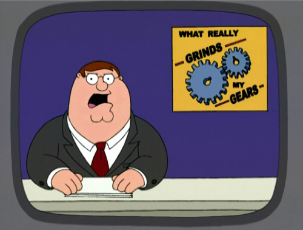
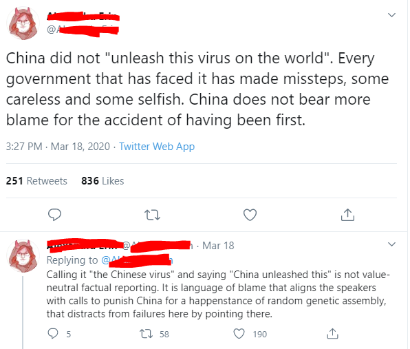
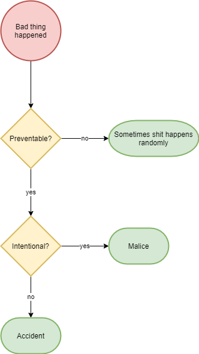
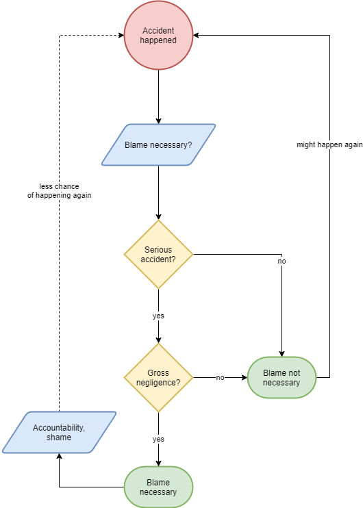
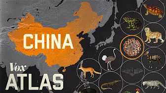
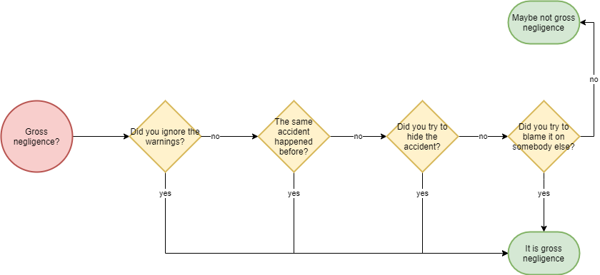

I didn't really want to write about politics in my blog - in fact I wrote a lengthy,
critical post about Trump before his election victory and just wound up leaving it
unpublished because I didn't want my blog to be about politics.

But this situation really grinds my gears to see the world pump out a continuous stream of
news articles and individuals discussing about the coronavirus and I don't think I've seen
more than handful individuals or more than one media outlet assign any blame to China. I
wrote this post as a therapy for myself.

My intention is not to blame the Chinese people - only the Chinese government. There is no
need for racism or xenophobia. The government is and was responsible for regulating
the wildlife trade and for responding to the outbreak. Individuals are not responsible for
my criticism. (["The buck stops here"](https://en.wikipedia.org/wiki/Buck_passing))

What happened
-------------

I don't think it's far fetched to say that China had an accident.

Let's quickly define an [accident](https://www.dictionary.com/browse/accident):

> an unfortunate incident that happens unexpectedly and unintentionally, typically
> resulting in damage or injury.

It's a safe assumption to say that the Chinese didn't do this intentionally (which would
be malice), so an accident is a good characterization.

There have also been people who argue that this is purely a random coincidence
("random genetic assembly") and therefore China is not to blame:

It is true, that the virus (SARS-CoV-2) happened due to random genetic assembly. But the
disease (COVID-19) that is causing unmeasurable physical, emotional and financial damage
around the world is not random.

To simplify: the virus assembled itself randomly, but the jumping of the virus to the
[patient zero](https://en.wikipedia.org/wiki/Index_case) **could have been prevented**.

Why assign blame for accidents?
-------------------------------

Accidents can happen to anybody. I know I've caused many. "To err is human".

What is [blame](https://dictionary.cambridge.org/dictionary/english/blame)? Definition:

> to say or think that someone or something did something wrong or is responsible for
> something bad happening

Nobody wants to be responsible for something bad happening. In this instance blame works
as a tool for inflicting shame on the person, or group of people, at fault.

What is blame good for? The shame caused by blame has at least these two possible positive outcomes:

1. It motivates the party being blamed to not make the same mistake again to avoid further shame.
2. Since nobody likes shame, it also motivates other people from making the same mistake.

Blame should not be used lightly. If the accident isn't serious, then blame might not be
necessary. But if it's a serious accident and due to gross negligence, then blame is
necessary.

I know gross negligence is
mainly a legal term, but I didn't come up with a better term. Here's the most suitable
definition for [negligence](https://www.atltriallaw.com/difference-negligence-gross-negligence/):

> Negligence is the failure of a person to exercise reasonable precautions that any
> sensible person might take, leading to cause another person a serious harm or injury.

My argument for when blaming is productive:

Was it gross negligence?
------------------------

Please watch this very good video first, originally titled:

> Why new diseases keep appearing in China

To summarize that video:

- The meat markets (called "wet markets") have very unhygienic conditions where the animals'
  cages are stacked on top of each other, where they are made to **shit, piss and bleed
  on top of each other**.
  * A great way to spread diseases.
  * Also very cruel.
- Wildlife farming industry industrialized, which increases the chances of diseases
  spreading because the animals are in small cages close to each other.
- China knows it's dangerous and banned wildlife meats before
  * But the elite successfully lobbied it back.

The description has a great summary of what happened:

> Both SARS and COVID-19 are in the "coronavirus" family, and both appear to have emerged
> from animals in China's notorious wildlife markets. Experts had long predicted that
> these markets, known to be potential sources of disease, would enable another outbreak.
> The markets, and the wildlife trade that supports them, are the underlying problem of
> these pandemics; until China solves that problem, more are likely to emerge. 

[SARS](https://en.wikipedia.org/wiki/Severe_acute_respiratory_syndrome) - sound familiar?
The same thing happened in 2002. After SARS China at least then finally knew that the
wildlife trade is dangerous - they closed the wet markets. But after the dust settled,
the elite wanted their exotic meats and lobbied them back open.

> After the SARS outbreak in 2003, which was traced to a wet market in the southern
> Guangdong Province, a temporary ban on wet markets and the wild-animal industry were put
> in place. In July of that year, the World Health Organization declared the SARS virus
> contained, and in August the Chinese government lifted the ban.

([source](https://www.nationalreview.com/2020/03/the-chinese-wild-animal-industry-and-wet-markets-must-go/))

The video description also lists these sources:

- [First Sars, now the Wuhan coronavirus. Here’s why China should ban its wildlife trade forever](https://www.scmp.com/comment/opinion/article/3047828/first-sars-now-wuhan-coronavirus-heres-why-china-should-ban-its)
- [How do bats live with so many viruses?](https://www.nytimes.com/2020/01/28/science/bats-coronavirus-Wuhan.html)
  * "They are considered the probable source of the coronavirus outbreak spreading from
     China. It turns out that they may have an immune system that lets them coexist with
     many disease-causing viruses."
- [Chinese Citizens Call for Permanent Ban on Wildlife Markets](https://wildaid.org/chinese-citizens-call-for-permanent-ban-on-wildlife-markets/)

China also [tried to cover-up the outbreak](https://www.theatlantic.com/ideas/archive/2020/03/china-trolling-world-and-avoiding-blame/608332/).

China also [tried to lie that COVID-19 came from the US](https://www.theguardian.com/world/2020/mar/12/conspiracy-theory-that-coronavirus-originated-in-us-gaining-traction-in-china).

So, to summarize:

- The wildlife trade in China is dangerous - to the whole world as we've witnessed - because:
  * the markets are unhygienic and
  * at least the bats are known to carry serious diseases.
- A serious disease outbreak (SARS) has happened before
  * caused by bats
- Yet the bats are continued to be eaten
  * which is again the likely cause for COVID-19
- China has acknowledged that the wet markets are dangerous by closing them previously
  * Yet they opened them again
- China tried to suppress the warnings about the outbreak
- China tried to put the blame of the virus on someone else

It is time for a flowchart: (there should always be time for flowcharts!):

The important thing to notice is, that all of China's actions to the yellow questions are
**yes** (= bad actions), i.e. they didn't do a single redeeming thing.

Argument: the time for blame is not yet
---------------------------------------

It's a compelling argument that when there are lives at stake, the most important thing is
to protect the lives, and there is time for blame later.

But given the breakneck speed of the news cycle, do you think the world has attention span
and stamina to keep doing mental work of making noise about this to prevent the same thing
from happening again, when we finally come out of social distancing and try to recover from
the physical, emotional and financial damage?

If the Trump phenomenon has taught us anything, is that the public forgets (or forgives) so
quickly that serious things get swept under the rug if they are not addressed ASAP.

Why individuals refuse to blame China?
--------------------------------------

This is just speculation.

I have followed the topic closely (it's all Twitter talks about..), and I really haven't
seen many people criticizing China.

On the individual level it might be due to not having an informed opinion about the facts,
or worse - [virtue signalling](https://en.wikipedia.org/wiki/Virtue_signalling) by assuming
all criticism about "different" group must be about racism/xenophobia and hence coming to
China's rescue to display one's superior morals.

I see this attitude all over Twitter:

While I agree, it might not be a good idea to call it "chinese coronavirus", implying
China is not at fault is simply incorrect.

Sure, many countries have made mistakes in preparing for the pandemic, but that does not
take away any blame for China's wrongdoings.

Why the media refuses to blame China?
-------------------------------------

This is also speculation.

It might be about fearing criticizing China is seen as racist/xenophopic. But it angers me
that the whole world is suffering and the media is not criticizing China to make sure this
never happens again. We owe it to all the people who have suffered.

Sure, [China closed the wet markets just now](https://www.businessinsider.com/china-bans-wildlife-trade-consumption-coronavirus-2020-2?r=US&IR=T),
but we've seen it also happen before and they were opened again after the dust settled.

We must ensure enough pressure and scrutiny to make sure things don't return to status quo.

Vox is in my opinion a heavily left-leaning
publication, and it surprised me that they made a video that was this critical of China.
But they soon started backpedaling. The first video title I saw was:

> Why new diseases keep appearing in China

Then they changed it to:

> Why the wildlife trade keeps causing diseases

i.e. they removed "China" from the title. And finally, now:

> How wildlife trade is linked to coronavirus

Now they are lessening the suggestion from:

- `wildlife trade` -> `causes`.
- `wildlife trade` -> `linked to`.

I don't know why they do this - they still have the powerful quote of "both appear to have
emerged from animals in China's notorious wildlife markets". And the sources which make
this situation quite clear don't seem to be debunked. And the video is still up. I don't
understand - they seem to be either pandering to China or virtue signallers who think
nobody should be blamed?

Far righters and far lefties
----------------------------

This is merely a sidenote. (Disclaimer: I consider myself a left-leaning centrist.)

The racists will probably use this incident to justify their racism. Racism about this is
just stupid. Quote from the Vox video:

> The majority of the people in China do not eat wildlife animals. Those people who consume
> these wildlife animals are the rich and the powerful –a small minority.

Remember, the criticism is aimed at the wrongdoings of China (the government) - not the
Chinese (all Chinese people).

The far lefties will keep virtue signalling and thinking that criticizing China is
racist/xenophobic.

Both of these far left-or-right stances are silly and only serve to polarize the extremes
even more because productive discussion cannot be had with people who care more about
emotions than facts.

Closing remarks
---------------

I'm pretty much just venting my own frustration. I tried to back my thoughts with logic.
If I got something wrong I'd like to hear about it - I'm one of those weak willed people
who would be happy to form new opinions, given new facts.

Hugs and kisses.

