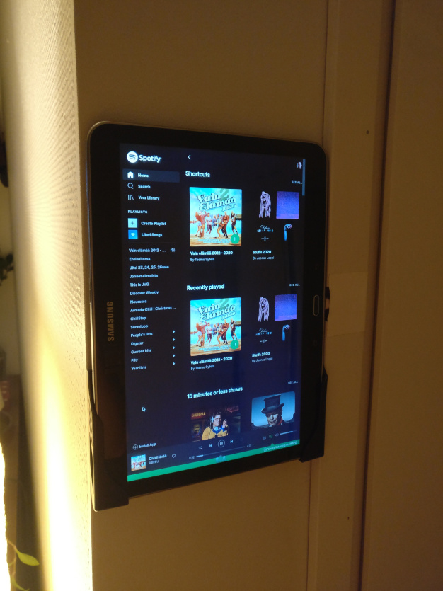
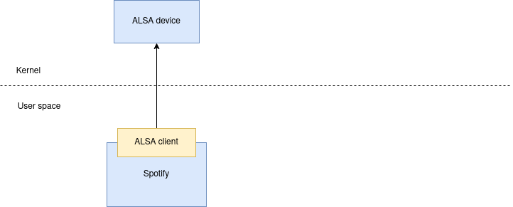
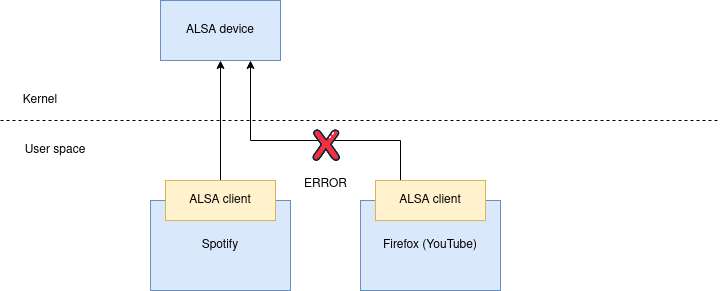
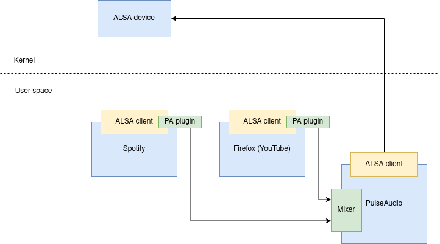

I wanted to get [Spotifyd](https://github.com/Spotifyd/spotifyd) working in a Docker container.
Turns out, audio and containers can be tricky. In this post I'll share what I learned on Linux
audio subsystems and considerations on container audio.

If all you want is to see "how to get Spotifyd to work with Docker", see the accompanying
[Spotifyd Docker image](https://github.com/joonas-fi/spotifyd-docker) that I released.

What is spotifyd?
-----------------

Spotifyd is a headless Spotify that can be remote controlled ("play music on device X") from the
Spotify desktop application, Spotify website and Spotify mobile apps.

My use cases include:

- Control the music in my living room hifi setup from a wall-mounted tablet (having Spotify in-browser).
- Have multiple Spotify instances (multiple accounts) running on my HTPC/server. Snap supports
  experimental [parallel installs](https://snapcraft.io/docs/parallel-installs), but I had trouble
  with the official Spotify snap somehow sharing login state where the instances got mixed up and
  thus too often I needed to logout/login.
- Easily toggle music between my work and living room (HTPC/server) computers, since with Docker I
  can guarantee Spotify is always running (even if I'm not seeing the frontend).

On Linux audio subsystems
-------------------------

### History

In the prehistoric times, there was [OSS (Open Sound System)](https://en.wikipedia.org/wiki/Open_Sound_System).
That was replaced by [ALSA](https://en.wikipedia.org/wiki/Advanced_Linux_Sound_Architecture), and
now most software is using [PulseAudio](https://en.wikipedia.org/wiki/PulseAudio).

It's not that simple though, as PulseAudio is higher-level abstraction and it usually uses ALSA
internally to actually output the audio.

### Why PulseAudio

Let's start with what ALSA is. ALSA consists of sorts client/server model. The server is ALSA
drivers in kernel, and the client being the user space ALSA library in apps like Spotify and Firefox
to talk to ALSA kernel drivers. Consider one program playing audio:

The above works. One weakness in ALSA was that it couldn't support support multiple programs
simultaneously playing audio:

NOTE: one can configure [dmix](https://wiki.archlinux.org/index.php/Advanced_Linux_Sound_Architecture#Dmix)
for ALSA which provides mixing and thus enables multiple apps outputting audio at once, but this
doesn't sound like there's first-class support for parallel streams in ALSA. I don't know enough to
say if this is the reason for the migration to PulseAudio, but PulseAudio is a more modern interface
and supports per-application volume control, Bluetooth, send audio over network etc.

### Enter PulseAudio

Since the world was already using ALSA, PulseAudio was added as a plugin to the
ALSA client libraries, so now existing apps who think they're talking to ALSA actually talk
indirectly to PulseAudio (which supports many inputs natively):

You can see from above drawing that existing apps didn't need to be rewritten to use PulseAudio (an
important driver to adoption). However most toolkits like SDL and Qt support PulseAudio natively, thus
skipping the unnecessary via-ALSA-client-PulseAudio-proxy layer. Some apps (like Spotifyd) default
to ALSA and [hide native PulseAudio behind a compilation flag](https://github.com/Spotifyd/spotifyd#pulseaudio).

In summary:

|                   | User space ("client") | Kernel ("server") |
|-------------------|-----------------------|-------------------|
| Before PulseAudio | ALSA client           | ALSA              |
| With PulseAudio   | ALSA client -> ALSA-plugin-PulseAudio-client -> PulseAudio -> ALSA client | ALSA |
| With native PulseAudio | PulseAudio client -> PulseAudio -> ALSA client | ALSA |

Containers and audio
--------------------

### The problem

The previous writing can be summarized to this: you need to know how the app-to-run-in-a-container
accesses audio. If you can configure it, great, use what suits the best, but sometimes you're stuck
with PulseAudio-via-ALSA if the app doesn't support native PulseAudio or you don't want to re-compile
to get it.

The client-side approaches (assuming your host system uses PulseAudio) summarized:

- ALSA client with ALSA-plugin-PulseAudio-client
- Native PulseAudio
- Use ALSA directly (without PulseAudio)
	* [Seems to work for some](https://github.com/jessfraz/dockerfiles/blob/e419219cde770d4ad197167d3dc6549bc9e3c2f8/chrome/stable/Dockerfile#L12)
	* Didn't work for me. It might be that my system didn't have dmix configured properly
	  (doesn't need it because using PulseAudio?) or it might be that I would have had to configure ALSA
	  client in container differently from defaults (= I didn't just know what I was doing).

So because I didn't get raw ALSA device to work and I didn't want to re-compile Spotifyd
(= can't use native PulseAudio), I was stuck with using the
"ALSA client with ALSA-plugin-PulseAudio-client".

I needed to map inside the container **both client requirements of ALSA and PulseAudio**.

### How I got to the solution

I had to use lots of [strace](https://joonas.fi/2018/11/30/strace-is-awesome/) to understand how
ALSA-based apps integrate with PulseAudio. Using strace I learned how the ALSA user space library
loads ALSA's config files (which tell to use PulseAudio plugin) and how the PulseAudio plugin loads
PulseAudio's config.

These config files need to be accessible inside the container, and since config file layout varies
based on Linux distributions, **this is particularly nasty** as there isn't universal
"add these Docker arguments to make audio work" switches then.

strace revealed that *in my system* config files are loaded in this order:

- `/usr/share/alsa/alsa.conf` is loaded first which has a line for telling to load `/etc/alsa/conf.d/*`
- `/etc/alsa/conf.d/99-pulse.conf` has a line for telling to load `/usr/share/alsa/pulse-alsa.conf`

There were many other config files, but I'm pretty sure these were the most important ones. These
could be condensed inside the container into a single file
([link](https://github.com/joonas-fi/spotifyd-docker/blob/master/alsa.conf)) that just tells
"yes yes, just proxy stuff to PulseAudio", but let's stick with this for now to move forward.

### The solution

I'm running Xubuntu and I had to map these inside the container:

- `/etc/alsa` - ALSA config files
- `/usr/share/alsa` - also ALSA config files (because why not have directories and directories of config files?)
- `/run/user/$UID/pulse/native` - PulseAudio's socket
- You need to map PulseAudio user's ID inside the container (Docker's `--user` flag), because the
  PulseAudio socket can only be accessed by that user. (There might be ways around this like adding Docker
    to the audio group or changing socket permissions or something.)

These might be optional:

- `/dev/shm`, depends on `enable-shm` in
  [PulseAudio configuration](https://manpages.debian.org/testing/pulseaudio/pulse-client.conf.5.en.html#DIRECTIVES).
  This is a performance enhancement that uses less memory copying ("zero copy").
- `~/.config/pulse`, if I didn't map this I got warning
  `Failed to load cookie file from cookie: No such file or directory` but audio worked anyway. 🤷

You also need to install ALSA and PulseAudio client libraries
(`libpulse0 libasound2 libasound2-plugins` on Ubuntu/Debian) inside the container.

Example Docker command:

	$ docker run \
		-v "/etc/alsa:/etc/alsa" \
		-v "/usr/share/alsa:/usr/share/alsa" \
		-v "~/.config/pulse:/.config/pulse" \
		-v "/run/user/$UID/pulse/native:/run/user/$UID/pulse/native" \
		--env "PULSE_SERVER=unix:/run/user/$UID/pulse/native" \
		--user "$(id -u)" \
		yourimagename

For a concrete example, see [spotifyd-docker](https://github.com/joonas-fi/spotifyd-docker). The
concrete version omits mapping host config files and `PULSE_SERVER` ENV var because the container
has "just use PulseAudio socket at hardcoded path" -config baked in.

Troubleshooting
---------------

### Start with the small stuff

Before you get `speaker-test` to make sounds, don't overcomplicate by expecting more complex things to work. :)

	$ speaker-test

Don't do as I did where I installed mp3 player and downloaded example mp3 file, before learning there's
a simpler way...

Bonus reading
-------------

- [Container sound: ALSA or Pulseaudio](https://github.com/mviereck/x11docker/wiki/Container-sound:-ALSA-or-Pulseaudio) (great overview on options)
- [run apps using audio in a docker container](https://stackoverflow.com/a/28995539) (StackOverflow answer updated section on PulseAudio socket)
- [spotifyd on k3s](https://emitbits.io/posts/41650/) (someone had exact same use case as me, but
  it didn't work for me due to my host environment being different I guess)
- [A Guide Through The Linux Sound API Jungle](http://0pointer.de/blog/projects/guide-to-sound-apis.html) (by PulseAudio's creator)
