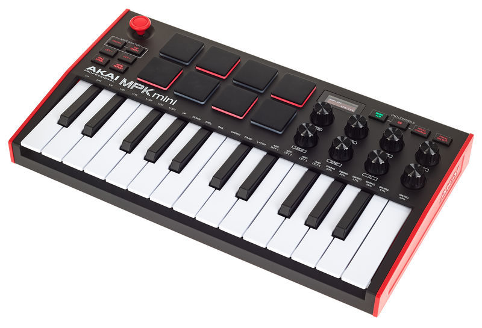
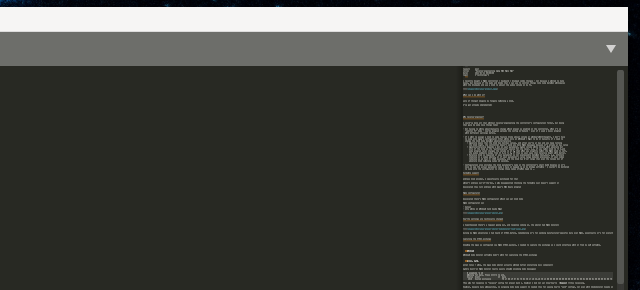
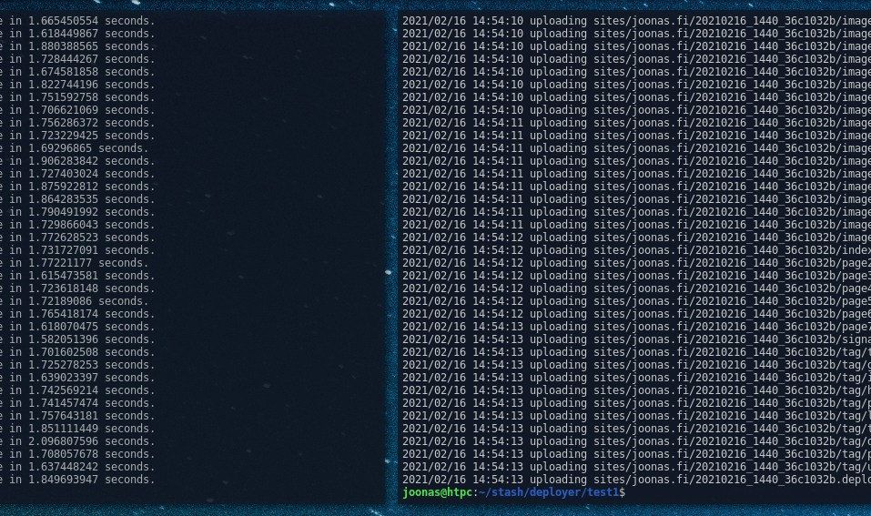
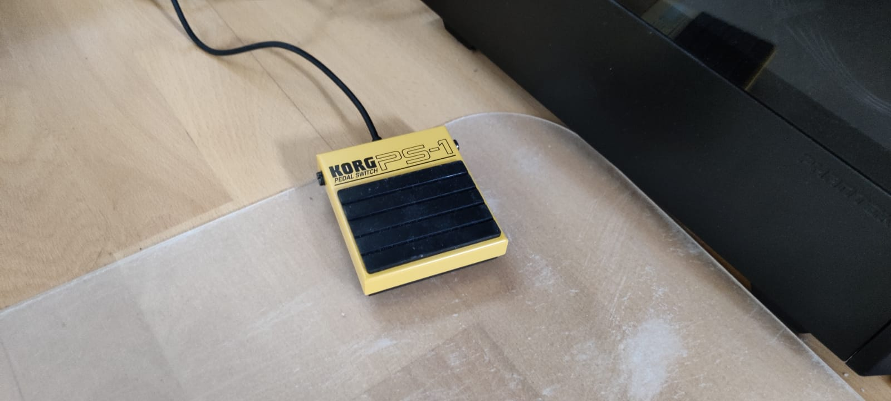
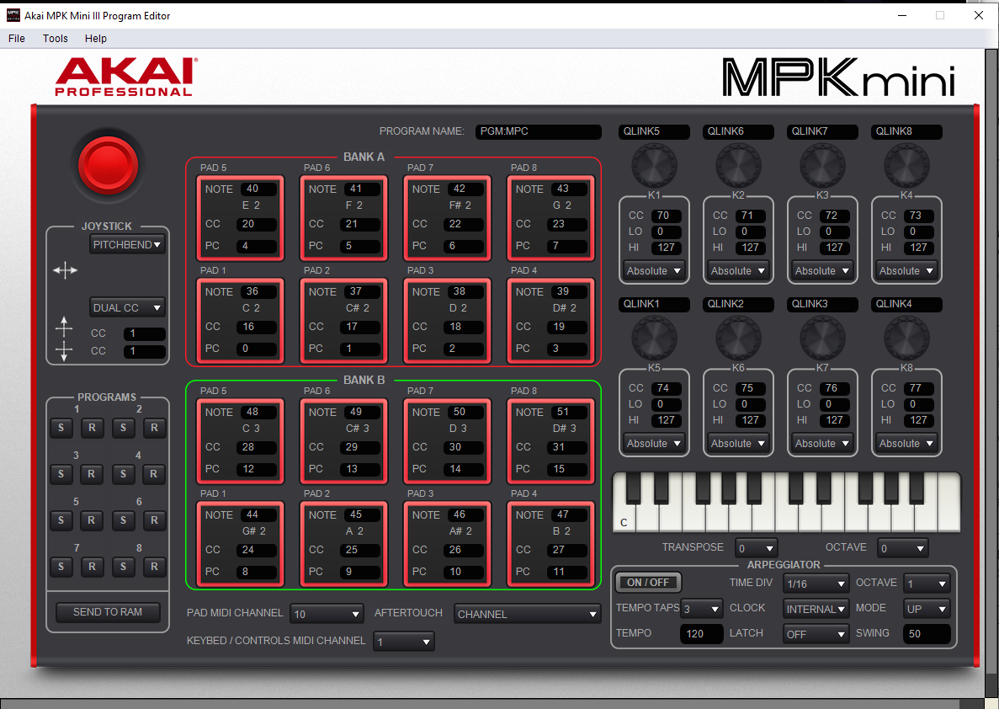
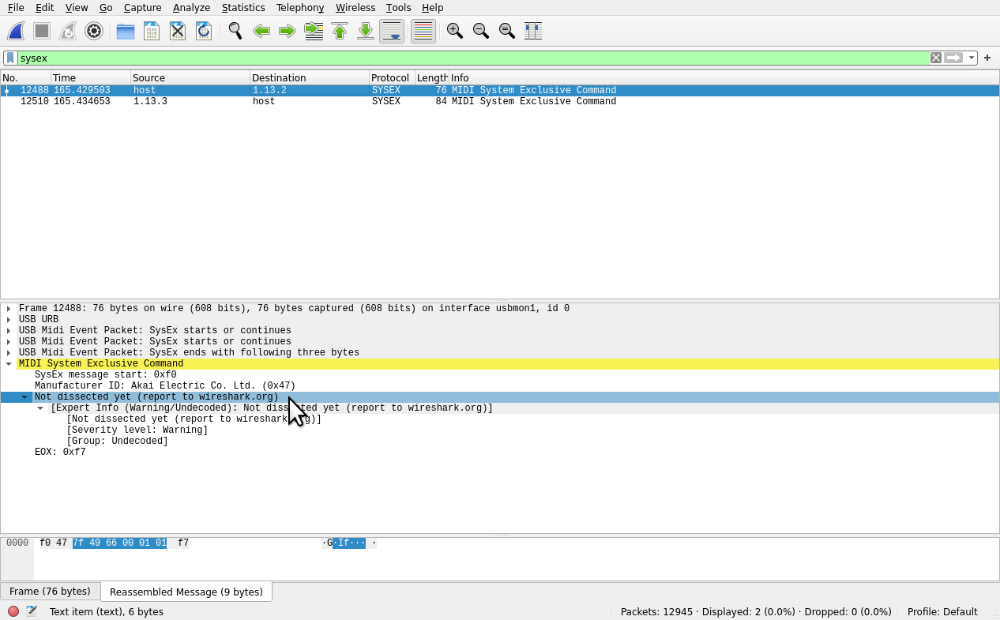
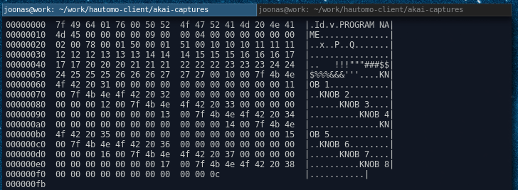

I recently bought a MIDI controller / keyboard / drumpad combo thingie. Not because I wanted to make
music - but because of the pads and knobs that I can use to control things like jump between workspaces
adjust the audio volume in my PC etc.




What can I do with it?
----------------------

Lots of things! I've already got implemented:


### Piano keys

Various key mappings to:

- Toggle audio between speakers and headphones
- Set random wallpaper (from a directory of curated wallpapers)
- Open a new empty workspace


### Drumpads to jump between workspaces

There are 8 pads so I can jump between 8 workspaces: (I number my less-often used workspaces above that 8.)

(Imagine my finger hitting a drumpad)


The drumpads have LEDs that light up when you hit them.. really satisfying feedback. 🤪


### Control audio volume

(Imagine my fingers twisting a knob)



It's really satisfying having a physical knob to control the volume. Takes me back to the olden days!


### Control text editor's column count

(Imagine my fingers twisting a knob)


### Control window size

(Imagine my fingers twisting a knob)




### Use a sustain pedal to trigger custom actions

I have this sustain pedal connected to the MIDI controller:



I can use [Turbo Bob](https://github.com/function61/turbobob)'s triggers to easily run any command
by pressing my foot:


Yes, I'm aware of "watches" that can do things automatically when a file is changed, but this is more
powerful.. I've even used it to `$ scp`-transfer built binaries to a remote another computer when I
needed to quickly iterate on something on a remote computer.


What got me into this path of even considering reverse-engineering
------------------------------------------------------------------

I specifically purchased this controller because it had rotary encoders, i.e. "endless knobs" (so that
there isn't a physical limit to how much you can turn the knob left/right).

Turned out they weren't endless out-of-the-box - I was disappointed.
At first I thought that the software just lazily didn't support that.
The controller stopped sending signals after it had reached the parameter's *software-imposed limit*.

I had an intuition and I tested AKAI's own music software (MPC Beats) and sure enough, it had deeper
integration with the controller and it configured some of the knobs to relative mode when you opened
their music program.

Thus I knew that this is controllable via software / the presets configurator.


Why reverse-engineer?
---------------------

I could've done all this without reverse-engineering the controller's configuration format, but it
gives me some nice things like:

- Not having to worry about/manually change which preset is enabled in the controller, when I enter
  "control PC" mode - now my program uploads the config on-the-fly - even if I used a music program
  with different settings before switching to PC control mode.
	* Presets are basically music programs the controller is supposed to control. They set MIDI channels
	  / MIDI controller numbers related to each pad/knob/key, knob names & modes, knob value ranges etc.
	* Usually when you jump from a program to another like from AKAI's music making software MPC Beats
	  -> my MIDI mapping bridge, you have to change the program-to-control from the MIDI controller,
	  unless the two programs expect the exact same config (highly unlikely) OR the **program can
	  configure the controller on-the-fly**

- If I want to assign a knob to some new feature (like adjust volume or window width/height), I don't
  have to jump into AKAI's configurator (that works only on Windows / Mac) to do it manually if I need
  to change the knob mode between absolute/relative
	* Absolute means that the knob has min/max values, and after you're at max and you keep turning
	  the knob right, the controller doesn't send any more MIDI messages because it's already at max value
	* Absolute/relative depends on your parameter. Audio volume works nicely with absolute but
	  **only if** the knob is the "authoritative" source for the level. I.e. if you twist knob to 75 % and
	  some program later changes the volume to 25 %, then when you slightly twist the MIDI knob to left,
	  the audio suddenly jumps from 25 % to 74 %. If this is your case then relative might work better.
	  It also depends if your target parameter supports relative adjustments.
	* Relative knob is required if your parameter is not expressible between (min,max), e.g. infinite
	  timeline in a video editor, or if your parameter's value range demands precision. If your video
	  timeline is an hour (= 3600 seconds), and the knob has 0-127 range then even the tiniest bit of
	  absolute knob twisting jumps 28 seconds.

- Configuration also includes the knob's name (= parameter's name it controls), which is shown when
  you are twisting the knob in the MIDI controller's small OLED display. OTOH I couldn't be bothered
  to jump into the configurator to change those names if/when need to remap knobs in the future, for
  what is essentially a gimmick, but now that I get it for "free".. it's nice.


AKAI's program editor
---------------------

I discovered you can change the knob settings (name, mode etc.) from the program editor, which:

- Works manually - you've to open the program to change the settings
- Only works on Windows and Mac




How the settings are technically changed
----------------------------------------

I hypothesized there's MIDI a request going out when you upload settings.
AKAI's editor had MIDI monitor window:


During my previous MIDI adventures I had heard of
[SYSEX](https://electronicmusic.fandom.com/wiki/System_exclusive) before, remembering it's for sending
manufacturer-specific data over MIDI. So upon seeing that I immediately had a "eureka" moment.
Essentially it's for everything else that MIDI (the standard) hasn't specified.
Configuration file formats are definitely things that MIDI doesn't have ready-made messages for.

Manufacturers usually use SYSEX to configure their devices.

Unfortunately, AKAI's "Midi Monitor" didn't show the contents of the SYSEX message.


Capturing the SYSEX exchange
----------------------------

Knowing the AKAI is configured via MIDI SYSEX packets, I needed to capture the exchange so I could interface with it from my own software.


### Windows

I tried to use some dedicated Windows-based MIDI monitor software but it didn't work for capturing
the SYSEX exchange. Akai's program editor software didn't work when the monitor software was running.


### Linux, ALSA

With Windows I had a dead-end regarding MIDI capture. Enter Linux + WINE. Despite my expectations with
WINE & exotic software the AKAI's program editor actually worked (after installing some MSVC component),
with minor visual defects.

ALSA's built-in MIDI monitor really easily showed incoming MIDI messages:

	$ aseqdump -p 28
	Waiting for data. Press Ctrl+C to end.
	Source  Event                  Ch  Data
	 28:0   System exclusive           F0 47 00 49 67 01 76 01 50 47 4D 3A 4D 50 43 00 00 00 00 00 00 00 00 00 09 01 00 04 00 00 04 00 00 00 03 00 78 00 00 00 00 02 01 01 24 00 10 25 01 11 26 02 12 27 03 13 28 04 14 29 05 15 2A 06 16 2B 07 17 2C 08 18 2D 09 19 2E 0A 1A 2F 0B 1B 30 0C 1C 31 0D 1D 32 0E 1E 33 0F 1F 00 46 00 7F 51 4C 49 4E 4B 35 00 00 00 00 00 00 00 00 00 00 00 47 00 7F 51 4C 49 4E 4B 36 00 00 00 00 00 00 00 00 00 00 00 48 00 7F 51 4C 49 4E 4B 37 00 00 00 00 00 00 00 00 00 00 00 49 00 7F 51 4C 49 4E 4B 38 00 00 00 00 00 00 00 00 00 00 00 4A 00 7F 51 4C 49 4E 4B 31 00 00 00 00 00 00 00 00 00 00 00 4B 00 7F 51 4C 49 4E 4B 32 00 00 00 00 00 00 00 00 00 00 00 4C 00 7F 51 4C 49 4E 4B 33 00 00 00 00 00 00 00 00 00 00 00 4D 00 7F 51 4C 49 4E 4B 34 00 00 00 00 00 00 00 00 00 00 0C F7

This was for response to "read settings" for preset slot 1.
However I did not yet know how to **request** this reading.

Despite incoming capture being easy, after many web searches, it seems ALSA has no outbound MIDI
capture support (I needed this for seeing how to "write settings" or to "please read settings").

[Drumstick MIDI Monitor](https://kmidimon.sourceforge.io/) seems inbound-only.
No luck on [Ask Ubuntu](https://askubuntu.com/questions/1223229/how-to-monitor-midi-output).

There are following scenarios:

| Scenario | Outbound MIDI | Inbound MIDI |
|----------|---------------|--------------|
| Read settings | SYSEX for "read settings" | SYSEX for "here are the settings you requested" |
| Write settings | SYSEX for "write settings" | (As far as I understand, no response needed) |


### Linux, Wireshark USB capture

Knowing our device's MIDI runs on top of USB transport, enter
[Wireshark USB sniffing](https://wiki.wireshark.org/CaptureSetup/USB).
For our purposes `USBaudio-midi` is the USB sub-protocol that we're interested in.

Enable `usbmon` module in kernel to enable monitoring USB traffic:

	$ modprobe usbmon 

Wireshark showed multiple `usbmon` interfaces, at first I didn't understand, but
[upon reading documentation](https://www.kernel.org/doc/Documentation/usb/usbmon.txt) it said:

> The character device is usually called /dev/usbmonN, where N is the USB bus
> number. Number zero (/dev/usbmon0) is special and means "all buses".
> Note that specific naming policy is set by your Linux distribution.

These correspond to `$ lsusb` output:

	Bus 006 Device 001: ID 1d6b:0003 Linux Foundation 3.0 root hub
	Bus 005 Device 001: ID 1d6b:0002 Linux Foundation 2.0 root hub
	Bus 004 Device 001: ID 1d6b:0003 Linux Foundation 3.0 root hub
	Bus 003 Device 001: ID 1d6b:0002 Linux Foundation 2.0 root hub
	Bus 002 Device 001: ID 1d6b:0003 Linux Foundation 3.0 root hub
	Bus 001 Device 011: ID 1050:0407 Yubico.com Yubikey 4/5 OTP+U2F+CCID
	Bus 001 Device 013: ID 09e8:0049 AKAI  Professional M.I. Corp. MPK mini 3
	Bus 001 Device 009: ID 1050:0407 Yubico.com Yubikey 4/5 OTP+U2F+CCID
	Bus 001 Device 007: ID 046d:c534 Logitech, Inc. Unifying Receiver
	Bus 001 Device 003: ID 05e3:0610 Genesys Logic, Inc. Hub
	Bus 001 Device 002: ID 19f7:0003 RODE Microphones RODE NT-USB
	Bus 001 Device 001: ID 1d6b:0002 Linux Foundation 2.0 root hub

It shows me that all my interesting devices are on bus 1. Therefore I can use `usbmon0` or `usbmon1`.

At first I was only seeing lots of undissected packages (what are all these `URB_BULK`'s?) with generic USB traffic:


But I'm glad I ran into
[someone's blog post](https://bulldogjob.com/news/97-how-i-reverse-engineered-synthesizer-protocol)
([link in blog post](https://desowin.org/usbpcap/tour.html)) that helped me understand the problem.

The solution: first start Wireshark monitor on USB bus 1 and **only after** plug in the USB cable of
AKAI, so Wireshark gets ahold of the USB descriptor and learns how to dissect the USB traffic.

I guess it's a handshake where the device introduces itself and tells what protocols it speaks (in
our case: `USBaudio-midi`).
These protocol identifiers are not present in subsequent messaging (I guess that makes USB pretty stateful),
so Wireshark doesn't know what type of data is flowing between the endpoints if it hasn't seen the handshake.
Makes sense now after understanding more.

It now works:




Reverse-engineering the contents of the SYSEX packets
-----------------------------------------------------

So, there are SYSEX messages for each preset slot:

- Write settings
- Read settings

There also is for reading/writing into "RAM slot". It's meant for on-the-fly configuration which is
wiped if you manually select another preset from the controller (or restart it).

Hexdumping it reveals it's a pretty straightforward to reverse-engineer:

	00000000  47 00 49 67 01 76 01 50  47 4d 3a 4d 50 43 00 00  |G.Ig.v.PGM:MPC..|
	00000010  00 00 00 00 00 00 00 09  01 00 04 00 00 04 00 00  |................|
	00000020  00 03 00 78 00 00 00 00  02 01 01 24 00 10 25 01  |...x.......$..%.|
	00000030  11 26 02 12 27 03 13 28  04 14 29 05 15 2a 06 16  |.&..'..(..)..*..|
	00000040  2b 07 17 2c 08 18 2d 09  19 2e 0a 1a 2f 0b 1b 30  |+..,..-...../..0|
	00000050  0c 1c 31 0d 1d 32 0e 1e  33 0f 1f 00 46 00 7f 51  |..1..2..3...F..Q|
	00000060  4c 49 4e 4b 35 00 00 00  00 00 00 00 00 00 00 00  |LINK5...........|
	00000070  47 00 7f 51 4c 49 4e 4b  36 00 00 00 00 00 00 00  |G..QLINK6.......|
	00000080  00 00 00 00 48 00 7f 51  4c 49 4e 4b 37 00 00 00  |....H..QLINK7...|
	00000090  00 00 00 00 00 00 00 00  49 00 7f 51 4c 49 4e 4b  |........I..QLINK|
	000000a0  38 00 00 00 00 00 00 00  00 00 00 00 4a 00 7f 51  |8...........J..Q|
	000000b0  4c 49 4e 4b 31 00 00 00  00 00 00 00 00 00 00 00  |LINK1...........|
	000000c0  4b 00 7f 51 4c 49 4e 4b  32 00 00 00 00 00 00 00  |K..QLINK2.......|
	000000d0  00 00 00 00 4c 00 7f 51  4c 49 4e 4b 33 00 00 00  |....L..QLINK3...|
	000000e0  00 00 00 00 00 00 00 00  4d 00 7f 51 4c 49 4e 4b  |........M..QLINK|
	000000f0  34 00 00 00 00 00 00 00  00 00 00 0c              |4...........|
	000000fc

If you compare it to the screenshot of the configurator: these stand out:

- QLINK 1-8. these must be the sections for each knob name and its settings
	* Distance between starts of QLINK5 and QLINK6 is 20 bytes
	* I tested from UI that knob name max length is 16 bytes
	* Absolute/relative mode
	* CC/LO/HI should all be one byte long

My process was to use the AKAI program editor:

- Capture writing the default configuration to the controller

- Making a small change to some individual setting and capture writing this configuration

- Visually inspect the difference in these messages

Here's me comparing a difference when I changed knob 1 mode from absolute to relative:



It's quite easy to just use your eyes to see **where** that setting is stored. A couple of hours later,
I had reverse-engineered the whole binary file format.


Finished support in my software
-------------------------------

### Further hurdles

I also had hurdles building my own software, where incoming SYSEX messages were discarded by the
library I was depending on. I traced the bug to some C++ code several layers down, fixed it and
[helped to get the fix to the above layers](https://gitlab.com/gomidi/midi/-/issues/21#note_492461681).


### Usage

Here's how I send the configuration to the MIDI controller:

```go
func akaiSendSettings(ctx context.Context) error {
	drv, err := driver.New()
	if err != nil {
		return err
	}
	midiOut, err := midi.OpenOut(drv, -1, "MPK mini 3:MPK mini 3 MIDI 1 28:0")
	if err != nil {
		return err
	}
	defer midiOut.Close()

	msg, err := mpkminimk3.CustomSettings(
		"Hautomo",
		10, // channel for pads TODO: this is -1 for some reason. we actually mean 9
		mpkminimk3.AutopopulatePads(36),
		mpkminimk3.AutopopulatePads(36), // TODO
		1,                               // channel for keys and knobs TODO: is this 1 or 0?
		mpkminimk3.KnobAbsolute0to127("KNOB 1", 70), // "K1"
		mpkminimk3.KnobAbsolute0to127("KNOB 2", 71),
		mpkminimk3.KnobRelative("i3 panel width", 72), // "K3"
		mpkminimk3.KnobAbsolute0to127("KNOB 4", 73),
		mpkminimk3.KnobAbsolute0to127("KNOB 5", 74),
		mpkminimk3.KnobAbsolute0to127("Sublime cols", 75),
		mpkminimk3.KnobRelative("i3 panel height", 76),
		mpkminimk3.KnobAbsolute0to127("Volume", 77), // "K8"
	).SysExStore(mpkminimk3.ProgramRAM)

	if _, err := midiOut.Write(msg); err != nil {
		return fmt.Errorf("error sending msg: %w", err)
	}

	return err
}
```

This is open source code, but is not officially published yet as of me writing this. It will land in
[Hautomo](https://github.com/function61/hautomo) (my home automation software).

If you're in a hurry and are interested in the code, I have put up the [.zip for download](akai.zip).
License: do not use in commercial code.
