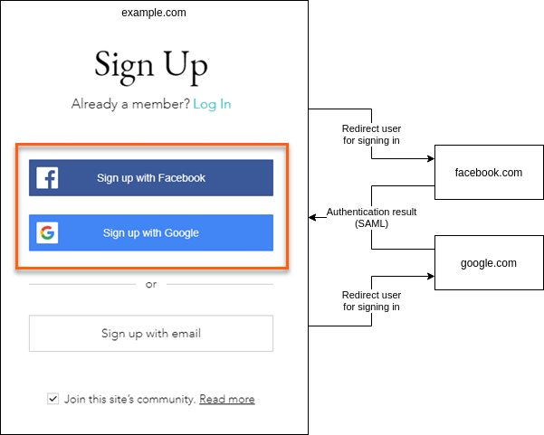
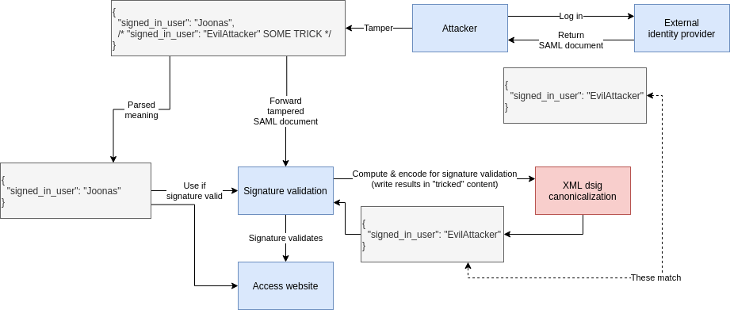

What is SAML?
-------------

> Security Assertion Markup Language (SAML) is an open standard for exchanging authentication and
> authorization data between parties.

Source: [Wikipedia](https://en.wikipedia.org/wiki/Security_Assertion_Markup_Language)

SAML is often used for [single-sign on](https://en.wikipedia.org/wiki/Single_sign-on)
("Sign in with Google", "Sign in with Twitter" etc.).
It means when you want to log in to example.com, example.com
can trust & use an external authentication provider to *assert* the user's identity for you. SAML
is about communicating these authentication & identity details across organization boundaries (web domains).



Update: although Google [supports SAML](https://support.google.com/a/answer/6087519) use cases,
Google/Facebook primarily use OAuth2 for these "Sign in with Google" general public authentication flows.
It was my bad for not clarifying that I used these more of *example of what Single-sign on means*.


Why should I care?
------------------

SAML is used in so many places, it probably affects your security too.

[SAML has recently had catastrophic vulnerabilities](https://mattermost.com/blog/securing-xml-implementations-across-the-web/)
with a really large impact.
For example, if I understood correctly
(I probably did, since the security researcher retweeted [my reaction](https://twitter.com/joonas_fi/status/1420717822716661762))
the Finnish tax authority, most government services and health record systems were vulnerable in such
a way that an attacker could have gone on to snoop people's tax returns, health records and basically
anything government-related that is available online.

It's been largely ignored by the media, perhaps because the vulnerabilities weren't taken
advantage of (or instances of such weren't detected).


Why is SAML insecure?
---------------------

SAML uses signatures based on computed values.
The practice is inherently insecure and thus SAML as a design is insecure.


Why is signing computed values dangerous?
-----------------------------------------

In summary: once you base your security on some computed property, you can now exploit any flaws,
differences or ambiguity in this computation. The more complex the computation is, the more dangerous it gets.
SAML signature computation is pretty fucking complex.

But let's move on to explain the concept. Let's take a pseudo identity document (actual SAML is XML though):

```console
$ cat assertion.json
{
  "signed_in_user": "Joonas"
}
```

We can sign[^1] the above file just as a bunch of bytes:

```console
$ cat assertion.json | sha1sum
e58dc03a7491f9e5fb2ed664b23d826489c42cc5
```

Now if we change the file just a little (I added space before the `{`).
We notice that the signature changes:

```console
$ cat assertion.json
 {
  "signed_in_user": "Joonas"
}
$ cat assertion.json | sha1sum
0bc80a9ee02f611b70319c9fe12b7e504107354a
```

This is a very good property, because ideally we want any changes (even those considered meaningless
at JSON level) to the security-critical document (which SAML is) to **produce different signatures**.

This property is known as [non-malleability](https://en.wikipedia.org/wiki/Malleability_(cryptography)).
[*Malleability* generic definition](https://www.vocabulary.com/dictionary/malleability):

> the quality of something that can be shaped into something else without breaking, like the malleability of clay.

Us signing the document as a raw byte blob makes this non-malleable, i.e. it can't be shaped without
breaking it. That's a desired behaviour in information security.

SAML is malleable because its signatures are based on computed values:

| Signature over  | Example                     | Raw content is malleable | Security |
|-----------------|-----------------------------|--------------------------|----------|
| Raw bytes       | File or message raw content | No                       | 👍       |
| Computed values | Parsed XML tree content     | Yes                      | 👎       |

To explain by example, let's get back to the JSON example. We'll use [jq](https://stedolan.github.io/jq/)
(a JSON transformation utility) to *compute* something from inside our document:

```console
$ cat assertion.json
 {
  "signed_in_user": "Joonas"
}

$ cat assertion.json | jq .
{
  "signed_in_user": "Joonas"
}
```

(`jq .` means just re-print the whole document)

Notice how piping the file through `jq` removed the space?
That's because at JSON level the space is not important.
At first sight this doesn't seem interesting, but we're heading to
[danger zone](https://www.youtube.com/watch?v=siwpn14IE7E) and fast.


Let's sign the computed value:

```console
$ cat assertion.json | jq . | sha1sum
e58dc03a7491f9e5fb2ed664b23d826489c42cc5
```

Even though the file still has the space modification, the signature now matches the original
signature (from the file that didn't have the space added).

Why's this dangerous?
Let's change the file again:

```console
$ cat assertion.json
{
  "signed_in_user": "EvilAttacker",
  "signed_in_user": "Joonas"
}

$ cat assertion.json | jq . | sha1sum
e58dc03a7491f9e5fb2ed664b23d826489c42cc5

# the above is because:

$ cat assertion.json | jq .
{
  "signed_in_user": "Joonas"
}
```

The signature still matches the original file.
This is because [duplicate keys are valid JSON](https://stackoverflow.com/a/21833017), removed upon
processing and most JSON implementations let the last key win.

Now what happens if you have two different pieces of code that process the SAML document and they have
different interpretations/parser behaviour regarding JSON duplicate keys (= message semantic content)?


An attacker asked the identity provider to sign an assertion for him, but due to SAML malleability he
was able to attack parser differences and tamper the document to still be valid for signature validation
but access data for a different user.

Now I have hopefully explained how malleability and basing signatures on computed / interpreted content
is dangerous.


The SAML vulnerability in practice
----------------------------------

It is not as straightforward as our JSON example what happened with these SAML vulnerabilities, but
this illustrates the principle of these vulnerabilities and their root cause: signing computed values
and malleability.

The latest vulnerabilities were due to
[XML round-trip instability](https://mattermost.com/blog/securing-xml-implementations-across-the-web/)
(see heading "What an XML round-trip vulnerability looks like").

In summary the vulnerability arises from when parsing XML -> writing XML produces semantically
different document, i.e. `encode(decode(xmlDocument)) != xmlDocument`).

I'm not 100 % sure but I think since the SAML signature validation needs a XML write step, it went
something like this:



The above would not be an an attack vector if SAML content-to-be-signed was non-malleable, i.e. any change
after the identity provider signs the document would be detected as a signature violation.


Why is SAML this way?
---------------------

Let's assume in good faith that the SAML designers knew non-malleability is a good property to have
and let's try to guess why they still ended up with a malleable design.

So, let's sign something. When one signs something, one get a signature as output: `sign(contentToSign, signingKey) -> signature`.

For the signature to be useful, you need to transport the `signature` along with `contentToSign` so
that when a consumer reads `contentToSign` they can verify it with the `signature`.

Sending this alone would have been easy to keep non-malleable:

```
contentToSign
```

But `signature` is missing. SAML designers probably didn't want to transport the SAML document and
its signature separately (the signature possibly in a HTTP header or URL parameter), so for
convenience they wanted to embed it in the same XML document:

```
samlDocument
├── contentToSign
└── signature
```

To be more technically correct, it gets even more YOLO than that. The signature is stored under
`contentToSign`, so upon the validation process the signature needs to be ignored ([again more
dangerous complexity](https://github.com/russellhaering/goxmldsig/blob/6f318b2f18251aa66983056c1db7e4eef312103c/validate.go#L252))
to not actually include it in `contentToSign` which would make it an impossible recursive problem:

```
samlDocument
└── contentToSign
    └── signature
```

But let's imagine the previous simpler case where the `signature` was **not** stored inside `contentToSign`
and get back to the question if we could've made signature validation byte-based!

The problem is that it is really hard to extract the bytes belonging to `contentToSign` from inside
the XML message. XML parser APIs to my knowledge don't support this use case. Even if some would, for
SAML to be useful they had to cater to what most XML parser implementations support.

=> When you have `samlDocument` and you'd want to access its sub-tree `contentToSign`, you only get
XML-level access there, so SAML designers probably didn't think much of it, went 🤷‍♂️ and said
"let's sign XML-level data then".

Signing output of an XML parser is really hard, because you're trying to keep signature input stable
from XML parsing output that has parser differences from XML library to library and from language to
language.
So that's why we have [XML dsig](https://www.w3.org/TR/xmldsig-core/) which has rules for e.g. sorting
XML attributes in
[some clusterfuck order](https://github.com/russellhaering/goxmldsig/blob/3541f5e554eefd0d2ef501e27544650d62bf5d22/etreeutils/sort.go#L58)
in order for SAML implementations to reach some kind of stable consensus on which byte sequence to validate
the signature against.
In the end we always need to match on bytes anyway.
This craziness is known as *canonicalization* and it transforms something like this this:

```xml
<Example   foo="hello"        bar="hehehe">
	<Item>    mooo</Item  >
	</Example>
```

Into bytes like this (so signature input is stable):

```xml
<Example bar="hehehe" foo="hello"><Item>mooo</Item></Example>
```

(This is just an example I invented, I'm not sure which rules actually exist
[but here are some examples](https://github.com/russellhaering/goxmldsig/blob/3541f5e554eefd0d2ef501e27544650d62bf5d22/canonicalize_test.go#L19).)

Summary: XML sub-trees are hard to sign/validate and there's some horrible things to enable that and
as empirical evidence shows, it's a security nightmare.

I'm willing to go on record and say that everything using approaches like these is broken and should
be considered insecure.


Vulnerability mitigation
------------------------

With Go's vulnerability they had to
[fix the round-trip instability in Go's XML stack](https://github.com/mattermost/xml-roundtrip-validator/tree/master/advisories),
and also as a safety precaution include
[round-trip stability validation](https://github.com/mattermost/xml-roundtrip-validator) before
actually processing the XML.

To recap, instead of validating signature from a bunch of bytes, for SAML signature validation we need:

- [Round-trip stability validation](https://github.com/dexidp/dex/blob/57640cc7a9f69ae71ac446449ead377974f3c8b9/connector/saml/saml.go#L303)
  (= XML parsing + encoding)
- XML parsing (again)
- XML canonicalization (XML dsig, which is encoding again but with specific complex rules and transforms)

If that sounds complex to you, it's because it is.
The more complex something is, the more likely it is to have bugs and security issues.


How could SAML have been designed better?
-----------------------------------------

I'm an amateur, so take my idea with a grain of salt, but let's try.

(Note: this post is all pseudo code - it's not real SAML. Here's [a real example](https://github.com/dexidp/dex/blob/766fc7ad990b51f656e03f03e157ba81da132552/connector/saml/testdata/assertion-signed.xml#L2) if you're interested.)

Instead of doing something like this:

```xml
<SAMLSignedDocument>
	<SAMLSignature>e58dc03a7491f9e5fb2ed664b23d826489c42cc5</SAMLSignature>
	<SAMLContentToSign>
		<Assertion>
			<UserId>Joonas</UserId>
		</Assertion>
	</SAMLContentToSign>
</SAMLSignedDocument>
```

(Which we established is difficult to sign/verify correctly and securely.)

Take the `<Assertion>` and serialize its sub-tree into bytes and store it as base64 or similar, so we
can transport it as bytes and only XML-parse it once the signature has been verified:

```xml
<SAMLSignedDocument>
	<SAMLSignature>e58dc03a7491f9e5fb2ed664b23d826489c42cc5</SAMLSignature>
	<SAMLContentToSign>PEFzc2VydGlvbj48VXNlcklkPkpvb25hczwvVXNlcklkPjwvQXNzZXJ0aW9uPgo=</SAMLContentToSign>
</SAMLSignedDocument>
```

I don't understand much about XML so there may be even prettier ways to transport strings or byte data,
but this should be enough to make a point.

This way they could've kept the property of everything being inside the one XML document - but you
just need to XML-parse twice:

1. First the outer document, then validate the signature against the byte blob
2. If the signature matches, only then parse the inner validated document

Sure, purists may argue that storing XML inside XML as a string or bytes is ugly (and I agree with you),
but look what we achieved.. The tradeoff is worth it - everything inside `SAMLContentToSign` is now
non-malleable and you don't need to parse security-critical data before it's validated as coming from
a trusted source. And we don't need the vomit that is "XML dsig".


More SAML weirdness
-------------------

SAML requires you to support use cases where the root of the XML document is unsigned, i.e. you only
sign the assertion elements. What is the purpose of allowing attacker-controlled data?
[You need additional code](https://github.com/dexidp/dex/blob/766fc7ad990b51f656e03f03e157ba81da132552/connector/saml/saml.go#L621)
to discard the unsafe data in these cases anyway because it'd be a catastrophe if you'd end up using it.


Why is SAML used if it sucks?
-----------------------------

I don't know. I'm not aware of a better standard - although I don't know the space well.

OAuth2 exists but is geared towards getting authorization to resources, so it's not an authentication /
identity protocol per se.
[More on the differences](https://www.okta.com/identity-101/saml-vs-oauth/).

[OpenID Connect](https://www.okta.com/identity-101/whats-the-difference-between-oauth-openid-connect-and-saml/) is also a thing.

My guess is also that once a standard gains traction, it's hard to migrate to a better option
even if one is available, since the previous option already has critical mass (think Whatsapp vs. Signal).


Action
------

Let's get rid of SAML. 🗑️ Some experts seem to recommend OAuth2 or OpenID Connect:

- https://twitter.com/pquerna/status/1338517755352387584
- https://github.com/dexidp/dex/discussions/1884

If a vendor is offering you SAML, ask for alternatives.


Ignorance is bliss
------------------

It is my experience that the more you learn about any subject, the more you realize it's all held
together by bubblegum and duct tape.
It's honestly pretty anxiety inducing.


When I was researching about this subject, I also noticed that the Finnish government websites' security
relies on a single-sign-on component implemented in JavaScript (not even TypeScript) which:

- [Casually parses security-critical certificates with string replaces](https://github.com/vrk-kpa/suomifi-passport-saml/blob/bb18027a6d89ca0b79c70cfdc34dc8fbb48de463/lib/passport-saml/saml.js#L1466).
- Mixes Node-style callbacks and explicit Promise usage, i.e. has different flow control styles.
- [It's only one forgotten `return` away from catastrophic flow control bug](https://github.com/vrk-kpa/suomifi-passport-saml/blob/bb18027a6d89ca0b79c70cfdc34dc8fbb48de463/lib/passport-saml/saml.js#L1342)
  where execution accidentally flows to `processValidlySignedPostRequest` despite signature validation error.
	* But that's what you get when you implement security-critical software with a language where flow
	control is not a language feature but a library feature built on top of the language.
	* TypeScript would at least have given proper async/await flow control with the compiler noticing most of the bugs.
	* Update: great news, [the upstream project](https://github.com/node-saml/passport-saml) the Finnish
	  gov't fork is based on, had recently been migrated to TypeScript. 🎉


Additional reading
------------------

- https://mattermost.com/blog/securing-xml-implementations-across-the-web/ writeup on the round-trip
  vulnerability from [@jupenur](https://twitter.com/jupenur) (the researcher who found it)

- https://twitter.com/jupenur/status/1423397250278084610 [@jupenur](https://twitter.com/jupenur)'s thread on SAML in general

- https://news.ycombinator.com/item?id=25424267 where a maintainer of an affected SAML library echoes some sentiments of my blog post.

- https://twitter.com/pquerna/status/1349234347266564096 (pquerna has authored security-related open source like a TOTP library)

- https://github.com/dexidp/dex/discussions/1884 (ericchiang is a security engineer and a major contributor to Dex)

- https://twitter.com/joonas_fi/status/1339205267637100546

- https://www.imperialviolet.org/2014/09/26/pkcs1.html - PKCS#1 has had a lot of issues resulting
  from parsing overly-flexible structures first, then validating things based on the computed
  result. "parsing is dangerous".

[^1]: `sha1sum` is not at all a good signing function but it works to demonstrate the principle.
