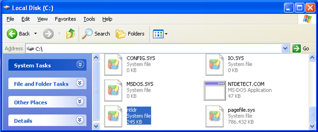
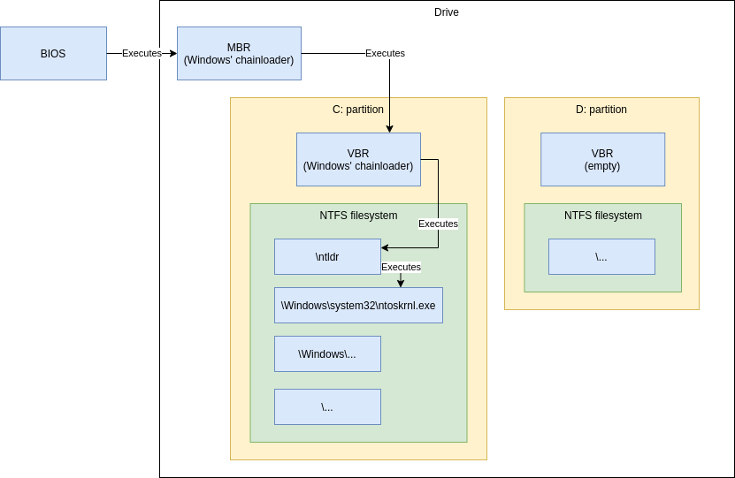
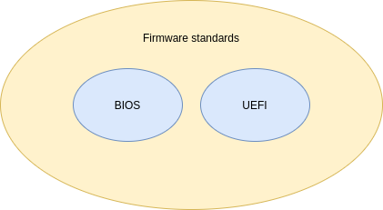
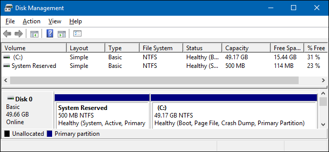
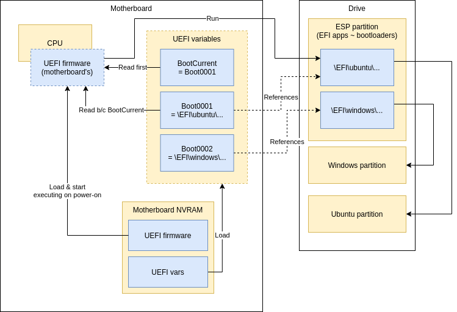
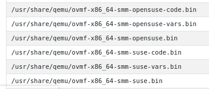
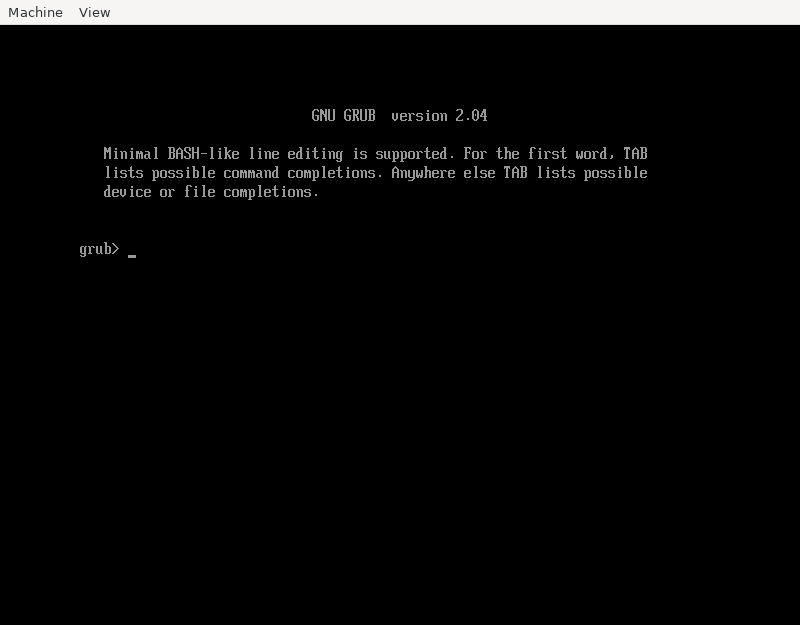
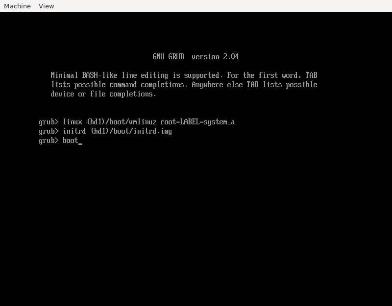
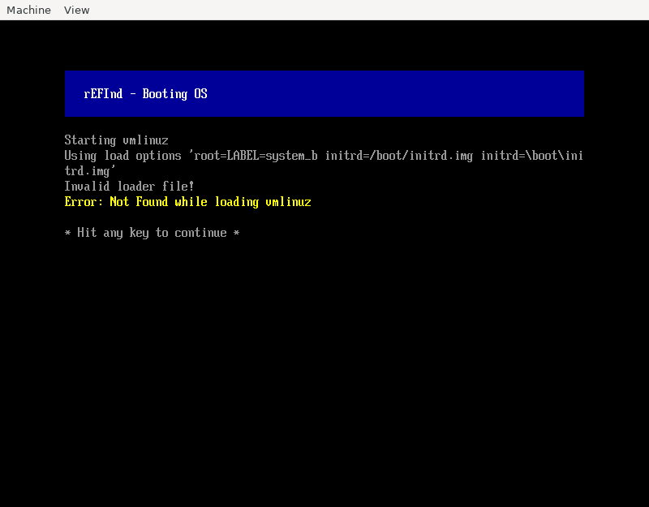

Recently I learned a lot more about UEFI/BIOS than I would've liked to, when I was configuring
[my new exotic system](https://github.com/joonas-fi/joonas-sys/)'s boot process. It just goes to show
you that when you step away from the well-traveled path, you're going to run into stupid problems
and have to understand deeper about how things work. So I'm sharing what I learned.

Legacy BIOS
-----------

To better understand UEFI, we must first dig into a little bit of history. Computers since the 1980s
have been using [BIOS](https://en.wikipedia.org/wiki/BIOS).

When we speak of BIOS, depending on context we mean different things:

- BIOS the standard
- Concrete BIOS implementation - the motherboard-specific firmware ("ASUS $motherboard_name BIOS")
	* = Code written or licensed by the motherboard manufacturer

When the computer powers on, the hardware is set up to start executing BIOS. That is all the CPU has to
know about, i.e. the CPU doesn't have to understand about drives, filesystems or operating systems.

### BIOS as a standard

As a standard it defines:

- [A hardcoded memory location](https://en.wikipedia.org/wiki/Reset_vector) where on power-on the CPU
  will begin executing BIOS code from.
- Disk locations where OS manufacturers can place their bootloaders to get their OS started
- [APIs](https://wiki.osdev.org/BIOS#Common_functions) for:
	* reading/writing data from/to hard disks and floppies (so not all programs have to deal with IDE/SATA/etc buses directly)
	* reading keyboard keystrokes
	* => BIOS is a hardware abstraction layer.
- Many things more

In these ways, BIOS is an API for:

- OS manufacturers
- CPU manufacturers
- Application developers. Though not much use nowadays because:
	* Developers interact with OS hardware abstraction APIs and even OS themselves don't use much BIOS APIs (since they control hardware directly for lower-level access)
	* Even in DOS times application developers probably used DOS APIs for abstraction instead of BIOS directly

### BIOS as the implementation

You might be familiar with updating your motherboard BIOS.
The BIOS-to-be-flashed is motherboard specific (i.e. there's no single BIOS that works for all motherboards),
because BIOS-the-implementation is motherboard specific.

I don't know everything there is specific to the manufacturer, but one thing I guess is different
[motherboard chipsets](https://en.wikipedia.org/wiki/Chipset#Computers), such as initializing/handling
memory controllers, built-in graphics etc.

### How a BIOS works

x86 CPU is defined to start executing code from a hardcoded memory location
([0xFFFFFFF0](https://stackoverflow.com/questions/7804724/how-is-the-bios-rom-mapped-into-address-space-on-pc)).
This memory location is backed by the motherboard's BIOS code ROM.
It is quite easy to electrically separate different address spaces where certain locations are
read from RAM and certain locations from BIOS ROM etc.
For a deeper dive into the concept electrically, [watch this video](https://www.youtube.com/watch?v=2iURr3NBprc).

Here's an oversimplified view:

The BIOS is responsible for
actually booting your OS.

In your BIOS settings you usually could configure the boot order like CD-ROM, Hard drive 1, Hard drive 2
etc, and any combinations thereof.
BIOS would find the first bootable item from your boot order preferences.

### Limitations of legacy BIOS

Most operating systems had to use a complicated chained boot process due to bootloader size limitations.

### Legacy BIOS boot process

With hard drives there exists a [boot sector](https://en.wikipedia.org/wiki/Boot_sector).
The boot sector, or more specifically [MBR](https://en.wikipedia.org/wiki/Master_boot_record#Sector_layout)
(Master Boot Record),
contains the bootloader and its size limitation is effectively [440 bytes](https://unix.stackexchange.com/a/254668),
so there's zero chance a bootloader that size alone can load a modern operating system.

Usually the MBR's bootloader passes control to the active partition's bootloader
([VBR](https://en.wikipedia.org/wiki/Volume_boot_record), Volume Boot Record), but it has the same size limitation.

Loading an OS at minimum means that the bootloader has to read the kernel (Linux/Windows/etc.)
from disk and give control to it.
The kernel is much wiser, and can understand various filesystems like NTFS/FAT etc.
But for the bootloader to read the kernel from the disk, it would have to know how to traverse the filesystem
to access the kernel.
For this reason, the bootloader reads and chainloads a
["second stage"](https://wiki.osdev.org/Bootloader#Two-Stage_Bootloader) from the root of the filesystem
(a much simpler task) - a file which can be larger and therefore can contain more complicated code.

In Windows this second stage used to be called [NTLDR](https://en.wikipedia.org/wiki/NTLDR)
("NT loader") and was at the root of your `C:` drive.

Here's about the boot process with legacy BIOS and an older Windows version:

As you can see, there's quite a lot of arrows - the bootloader components are spread out all
over the place. Three different Windows-specific places for starting to load the actual kernel.
All it takes is for one of the pieces to get borked and you'll end up with non-bootable system.

It's roughly the same for Linux (chained GRUB bootloader stages).

Modern times: UEFI
------------------

### Why do we need UEFI?

Due to limitations of the legacy BIOS, a new standard was developed, called
[UEFI](https://en.wikipedia.org/wiki/Unified_Extensible_Firmware_Interface) (often shortened to "EFI").
UEFI does the same things a legacy BIOS used to do (and more), but the interfaces (standard, "the API")
are different.

Instead of tiny bootsectors we now have a dedicated partition large enough to contain the whole
operating system bootloader so we don't have to chain multiple parts together.

UEFI also gives us network booting, security like
[secure boot](https://en.wikipedia.org/wiki/Unified_Extensible_Firmware_Interface#SECURE-BOOT) etc.

### UEFI is not BIOS

The sometimes used term "UEFI BIOS" is incorrect (even my motherboard manufacturer ASUSTeK uses it),
because both UEFI and BIOS are subtypes of firmware - i.e. separate, different, standalone firmware
standards:

Maybe because some people refer to UEFI BIOS, people use the term "legacy BIOS" to mean "yes, I'm really talking about the old IBM-era BIOS".

(Sidenote:
[there exist also other firmware standards](https://asahilinux.org/2021/03/progress-report-january-february-2021/#bridging-two-worlds), like DeviceTree)

### EFI system partition

As a Windows user you might've noticed that there is this mysterious "system reserved" partition:

This is the [ESP (EFI System Partition)](https://en.wikipedia.org/wiki/EFI_system_partition) - a partition
used for booting an EFI-compliant system.

The ESP is usually [FAT32](https://en.wikipedia.org/wiki/File_Allocation_Table#FAT32)-formatted
partition with minimum 100 MB of space, some guidelines suggesting 512 MB.

The partition contains [EFI applications](https://en.wikipedia.org/wiki/Unified_Extensible_Firmware_Interface#Applications),
usually in own directories. There can be multiple EFI applications because you might have multiple
operating systems installed.
In my mental model I think of these directories as "slots" for each of my OSes.

You can quite easily create this partition from scratch with basic Linux built-in utilities
(`$ fdisk`, `$ mkfs.fat -F 32`) if you want. Just be sure to set partition type to EFI system!

Fortunately an ESP is not magic - it's just a partition with files and some file paths have
special meaning (default EFI app to boot if no boot selection indicated).

### EFI variables

EFI specifies that there are variables stored inside your motherboard NVRAM. One of these variables is
the default boot entry ("BootCurrent"), which points to another variable (one of the boot entries) that
contains the path to the EFI application to boot.

The boot entry variable can also contain additional arguments for the EFI application.
One of these uses is Linux EFI stub (more on this below), where the variable contains Linux kernel
command line that has to specify which partition the root filesystem is in
([link](https://wiki.debian.org/EFIStub#Add_the_boot_entry)). GRUB doesn't need this, since that is
specified in a configuration file.

These variables can be modified from your OS, so you no longer have to "boot into BIOS" to change
boot order or add new boot entries etc.

### Boot process with EFI

Motherboard's firmware is basically always in flash (so it can be upgraded). EFI var storage needs
flash anyway, because they're not very good "variables" if they cannot be changed. :)

### Linux EFI stub

[EFI stub](https://wiki.archlinux.org/index.php/EFISTUB) feature in Linux means that the kernel image
looks like an EFI application, so the kernel can be directly loaded without a separate bootloader -
skipping GRUB (the most popular bootloader for Linux).

Why use EFI stub? It might be because I don't know what I'm doing, but I ended up with both: ..

- GRUB in my `/boot` (NOT the ESP) **and**
- GRUB in the ESP

.. when I was testing some boot setup things in a VM.
I didn't know which one I should edit and where to debug when I couldn't get the dual-boot working
(turns out my hypervisor was not persisting EFI vars).

This was a catalyst for me to use EFI stub, because less software means less complexity.

Linux EFI stub is not perfect though. Since you need to give the kernel (the UEFI app) special arguments
(where the root partition is) for it to boot, these arguments need to be in the NVRAM. If the NVRAM
gets emptied or the NVRAM becomes faulty, the arguments get lost and you system is not bootable.
Usually UEFI implementations let you even navigate to an UEFI app from the ESP to boot, but that
alone doesn't work without the extra arguments. With "argument-less" EFI apps if your NVRAM becomes
faulty you can just navigate to the UEFI app to boot it.

### Implications of EFI variables

State is littered around the motherboard (EFI vars) and the drive (ESP).
Therefore you can't expect to throw your drive in a new motherboard and be 100 % sure it works, because
EFI vars can contain arguments for EFI apps (like Linux Kernel command line parameters if you're using EFI stub).
Although this "Linux EFI stub" might be a fringe use case and not ideal usage pattern
(perhaps EFI applications should be runnable without additional arguments.)

Naively I would've preferred the EFI vars to live in the ESP but then again, a drive itself alone
semantically shouldn't be allowed to specify how the computer should boot..
Perhaps this was better than the added complexity of supporting EFI vars both in motherboard NVRAM **and** the ESP.

One frustrating thing about EFI variables is that their storage format is internal to the specific
EFI firmware, i.e. each motherboard can have different storage format for the variables.
This is not a problem in normal use (regular users don't need to know), but remember that virtual machines are
essentially software defined computers, and sometimes you would want to specify EFI variables (like
use Linux EFI stub to boot Linux) before booting a VM, but there is no generic way to modify the
variables except from inside the VM or some other EFI application already running inside the VM.
Granted, in this use case you can control the EFI firmware that'll be booting your VM, and thus you
know the internal storage format and can get/write tooling to manipulate the vars, but that's one more
thing to worry about. [Read more](https://rwmj.wordpress.com/2015/03/25/edit-uefi-varstores/).

QEMU and UEFI
-------------

QEMU is a generic and open source machine emulator and virtualizer. It allows you to run VMs.

### Built-in boot modes

QEMU has built-in support:

- For legacy BIOS booting
- [Directly booting Linux](https://qemu.readthedocs.io/en/latest/system/linuxboot.html)
	* By specifying paths (in your host!) to Linux kernel and
	  [Initrd](https://en.wikipedia.org/wiki/Initial_ramdisk) with switches `-kernel` and `-initrd`
	* You probably also have to define a Linux command line with `-append` (example: `-append "root=/dev/sda1" `)
	* This is great for testing, but a bit weird for "normal VM usage" because QEMU needs to first access
	  the kernel and initrd which are usually stored inside the VM's filesystem. You either need a
	  hack to temp-mount the VM's FS on the host to grab a copy the kernel and initrd or reverse
	  the traditional ownership model of VM managing the kernel+initrd and just embrace the model of
	  the host being in charge of VM's internals. I.e. you accept that if you update your OS inside
	  the VM and the kernel gets updated, you'll accidentally boot next into the old kernel unless you
	  remember to copy the in-VM copy of the kernel to host-side copy of the VM-kernel.
- UEFI boot
	* But only if you specify the UEFI firmware files - QEMU doesn't provide them (it does for legacy BIOS)
	* This means you have to download external UEFI firmware (usually a simple task of asking your package manager though)

### QEMU and UEFI boot

Like mentioned above, you have to provide the UEFI firmware. One popular choice for virtualized
hardware is OMVF (I guess it's a sub-project of EDK II) by TianoCore.

Summarized, you can UEFI boot VMs with switches:

	-drive if=pflash,format=raw,unit=0,readonly,file=OVMF_CODE-pure-efi.fd \
	-drive if=pflash,format=raw,unit=1,file=OVMF_VARS-pure-efi.fd \

The first is the firmware, and the second is the EFI vars storage file (assuming you want your changes
to EFI vars to persist across VM reboots). The `pflash` stands for
[platform-specific flash](https://wiki.qemu.org/Features/PC_System_Flash).

Most popular distros have packages that you can get with your package manager, but I didn't seem to
have luck in finding my "EFI vars" file in the package I installed for Ubuntu. Remember, EFI vars storage
format is specific to firmware (in this case OMVF), even the version, and therefore I had to find my
OMVF (firmware, EFI vars file) combo from elsewhere.

### Managing boot options from OS

Look into [efibootmgr](https://wiki.archlinux.org/index.php/EFISTUB#efibootmgr) command.

[efivar](https://wiki.archlinux.org/index.php/Unified_Extensible_Firmware_Interface#UEFI_variables) command might also be of interest.

### Finding working firmware and EFI vars file

(WARNING: I might've messed up because when later testing the OVMF files provided by apt-get they seemed to
work. But I'll leave this chapter in case it helps someone else struggling)

I found an
[openSUSE package](https://opensuse.pkgs.org/15.2/opensuse-update-oss-x86_64/qemu-ovmf-x86_64-201911-lp152.6.2.1.noarch.rpm.html)
and I think I tried combo `(ovmf-x86_64.bin, ovmf-x86_64-vars.bin)` from there **but did not get it working**.

Eventually, many hours later, I found an RPM package
([directory listing](https://www.kraxel.org/repos/jenkins/edk2/))
that had a working combo: `(OVMF_CODE-pure-efi.fd, OVMF_VARS-pure-efi.fd)`.

It is an RPM package, but I could extract the files with this command:

	$ rpm2cpio edk2.git-ovmf-x64-0-20201222.1544.g6c5801be6e.noarch.rpm | cpio -idmv

([Credit](https://stackoverflow.com/questions/18787375/how-do-i-extract-the-contents-of-an-rpm))

Most of these UEFI firmware packages contain multiple variants with triplets of each `($.bin, $-code.bin, $-vars.bin)` combo, like:

I don't know what the difference between the base and `-code` versions are in the triplet. They both
are somewhere around 2 MB so I guess they're both firmware (the EFI vars file is much smaller!), so
I tried the `-code` one and it worked for me..

There are abbreviations like `ms`, `4m`, `smm` etc. for each variant. I suspect variants are set up
with secure boot, some are not, some have different signing keys etc.
I'm not using secure boot, but I just wanted to share if it helps. I went with the most bare, "pure"
variant because it sounded like it has secure boot disabled.

### Troubleshooting

I booted so many times into my Ubuntu VM to use `$ efibootmgr` to edit my boot options, and then shut down
the VM only to notice that the vars file was not changed (I compared `$ sha256sum` between reboots).
I didn't even know if QEMU would update the EFI vars file after shutting down the VM or immediately
when the var is modified.. Just goes to show that before you start with a working condition it's much
harder to try to operate on only safe assumptions.

This was before I found the correct working firmware-EFIvars combo from kraxel.org. I didn't get any
error messages - the EFI vars file was just not being updated. Somewhere along the stack (in QEMU or
OVMF) there was an error that prevented updating the EFI vars NVRAM and I was not given any error code,
just bold faced lie of silent success. Ugh. Computers..

What I wish I had tried earlier was to just boot into EFI shell because you can edit EFI vars much
faster there without booting and logging in to the OS (to top it off, I was having intermittent
[graphical glitches](https://bugs.launchpad.net/ubuntu/+source/linux/+bug/1872863) so I had to boot
many times to even reach the VM).

[Read more about UEFI shell & important commands](https://wiki.archlinux.org/index.php/Unified_Extensible_Firmware_Interface#Important_UEFI_Shell_commands).

Why is everything so hard?
--------------------------

I'm left highly annoyed, once again thinking "computers were a mistake". Why are these things so
poorly documented and so hard.. Prepare your body for a rant.

### My troubles with UEFI

- Had to learn the hard way that UEFI firmware and UEFI vars file are deeply dependent on each other
  & maybe even exact versions

- When I did something wrong and I "successfully" changed boot options (EFI vars), I was being
  lied to and the changes just didn't persist after reboot without any explanation to me. If you write
  important code that ignores the error case, you should have your developer rights taken away.

- UEFI's built-in strategy seems to try booting each boot item in order and treating each error equally
  with "it didn't work so I guess it wasn't supposed to work so let's not show any error messages
  and continue to next item". This means that when you try to boot something exact, it goes in totally other
  direction without explanation and you're left wondering what just happened.
	* I understand having boot options like removable drives before your OS and their errors being
	  expected in nature and thus not showing error messages, but I think there should've been a
	  distinction between expected and unexpected errors - the latter of which should've been shown to
	  user, preferably with option of managing the boot options if there accidentally is a non-booting
	  unexpected error before the actual bootable OS option.

### My troubles with bootloaders

Bootloaders seem to be notoriously bad at explaining what went wrong, often hiding error messages
and GRUB just throwing you into a prompt expecting you're a bootloader developer.
Think of how often that expectation is true and how often there's a helpless user with a desire to
be helped in understanding what went wrong and how to disaster-recovery boot into the OS? A bootloader
has only one job..

Here's a screen you get when you're stuck with non-booting GRUB installation:

Does the above answer:

- What was the error that ended up getting us here?
	* It clearly must've been an error because what % of installations actually expect to boot into GRUB?
- What you should do next to boot into Linux?

Here's how to boot from this situation:

Does somebody expect me to remember those magic spells?

Moving on to roast rEFInd.. It has a curious feature where when you specify a `volume` it can't find
(or access), it just silently continues and the next error you get is just a symptom of the volume
not being found but you're essentially getting **an unrelated error message**.

I tested by specifying `volume notGoingToFindThis`. Here's what I got:

This error message ("not found while loading vmlinuz") is proudly ambiguous enough to maybe mean:

- The kernel was not found
- The kernel was found but the kernel reported "not found" while trying to boot? Was initrd.img missing?

Would `not found: /boot/vmlinuz` have been too helpful? But I digress.. the error message actually
had a third meaning: the partition I specified was not found (so of course none of the files will be found).

I don't even want to think how many hours I lost because of this. My actual problem was more nuanced
(not just a stupid typo) and might've been because my VM specified a partition-less disk (which Linux
supports), which I guess rEFInd doesn't support so my volume was not being found even though I had
the correct label. That's totally reasonable, but give me the right error message instead of sending
me on a goose chase!
