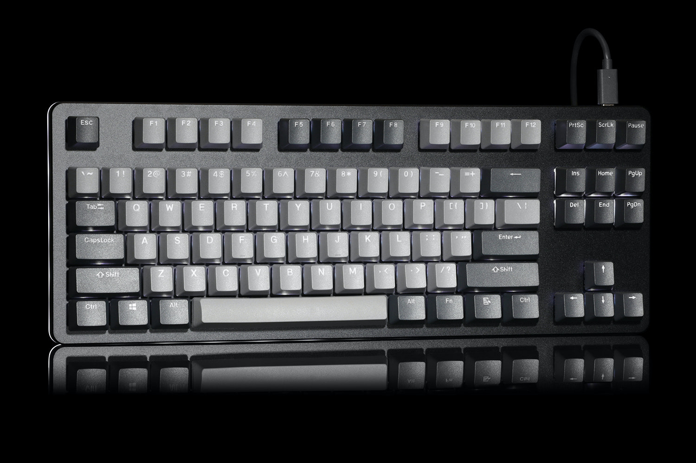
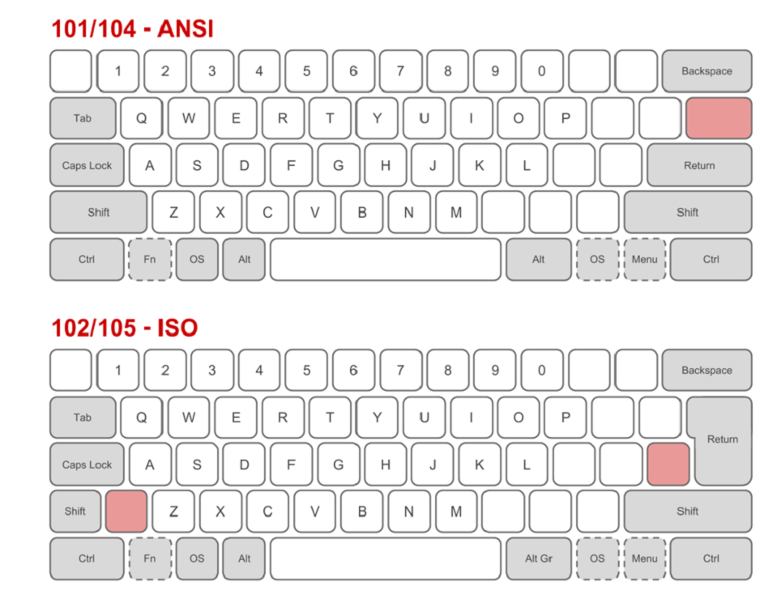
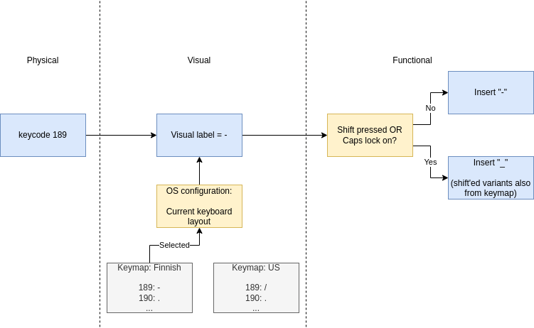
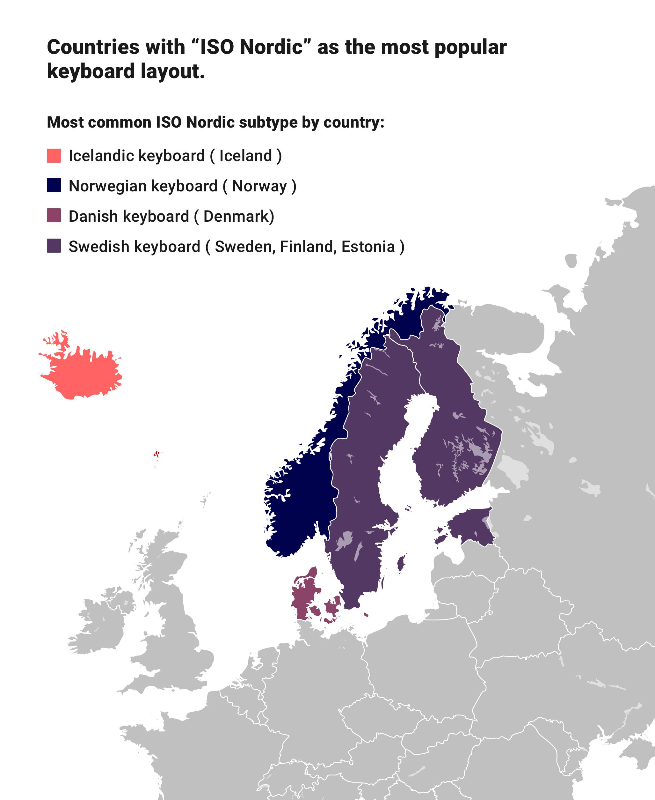
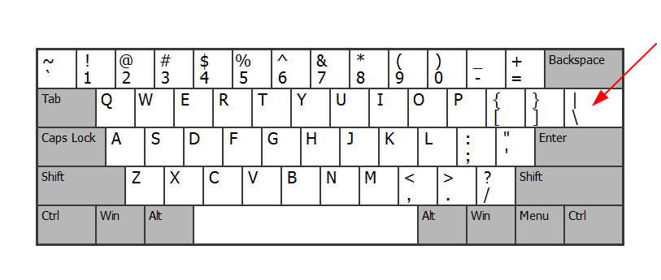
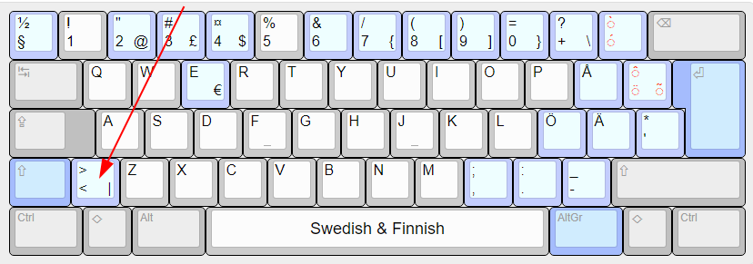
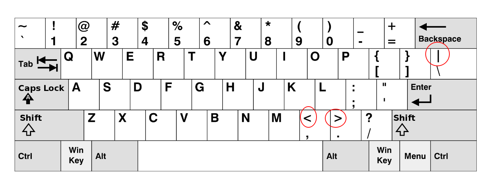

I recently bought a [Drop CTRL](https://drop.com/buy/drop-ctrl-mechanical-keyboard) mechanical keyboard.
(am not sponsored & I actually [dislike the company](/complaint-corner/2022/drop-spam/))



I debated myself for a long time whether to buy the keyboard, due to these problems:

- it has ANSI layout (I'm used to ISO layout), and
- the keycap labels don't match either so some keys' labels won't match what actually comes on screen
  when I press them.

Keycaps can be changed, so I figured if it bothers me I can always solve the mismatching labels problem.

But the ANSI vs. ISO layout thing is a bigger issue that can't directly be addressed.
We'll discuss it in the next chapter.


Theory on physical vs. visual layouts
-------------------------------------

It took me a while to grasp that there are three different concepts at play here.
(Wikipedia has fantastic explanation of [these concepts](https://en.wikipedia.org/wiki/Keyboard_layout#Physical,_visual,_and_functional_layouts))


### Physical layout

= Key count, locations and shapes.

- This is described by ISO/ANSI. Also there is JIS (for Japan).
- ISO usually has 102 or 105 keys, while ANSI has 101 or 104 keys
- ISO has larger `Enter` key, ANSI has smaller. The shape is considerably different too.
- Location of one key: a key in ISO layout at left of `Enter` jumps to top of `Enter` in ANSI
- ISO has one **additional key** to right of `Left shift`, and the key happens to be very
  important in programming, at least on a Finnish layout.
- Each key has a numeric keycode, like the key (usually) labeled `X` is sent to computer as
  [keyCode = 88](https://www.toptal.com/developers/keycode/for/88).



([Source](https://www.makeuseof.com/ansi-vs-iso-keyboard/))

The labeled keys in the picture above are keys that have the same meaning for most visual layouts.

The empty keys are keys that have different meaning for different visual layouts.
Consider the key to left of `Right shift`:

- it produces `-` when used with Finnish keyboard layout
- it produces `/` when used with US keyboard layout


### Visual layout (+ keymap)

= What is the label written on top of each physical key.

- You can usually change this by buying new keycaps or arranging the existing keycaps differently,
  e.g. wanting to use [Dvorak layout](https://en.wikipedia.org/wiki/Dvorak_keyboard_layout). The
  physical key under what used to be #88 in QWERTY will still be #88 in Dvorak, but will be
  in software assigned a different meaning (= visual layout) in Dvorak layout. E.g. 88 will mean Q instead of X.
- The keymap refers to having a table of keycode-to-visual-label mappings.
- The keyboard unfortunately doesn't communicate its visual layout to the computer, so that's
  why your computer must ask you which visual layout the keyboard uses.
  The keyboard will only send "physical key 88 was pressed" events.

Keymap for QWERTY could look like this:

| Key code | Visual label |
|----------|--------------|
| ...      | ...          |
| 88       | X            |
| 89       | Y            |
| ...      | ...          |

And for Dvorak:

| Key code | Visual label |
|----------|--------------|
| ...      | ...          |
| 88       | Q            |
| 89       | F            |
| ...      | ...          |

This is the mechanism for how different countries have different customizations, like in a keyboard
purchased in Finland we have visual label `Ö` for the key that in US keyboard is labeled `,`.


### Functional layout

= What happens in software when a visual key like `A` is pressed.

- Defined by the software that receives the visual layout keypresses.
- It means that the visual label `A` doesn't just blindly always insert "A" on the screen.
- Pressing `A` key usually inserts "a" on the screen, but "A" if `Shift` key is held (or `CapsLock` has been enabled).
- There's also some universally accepted key combinations like `Ctrl` + `C` that copies to clipboard.
- Also you can in theory by software remap that the visual key "A" inserts "b" into the screen.
  This wouldn't make sense, but this demonstrates the difference of visual and functional layouts.


### Summary




Back to dealing with Nordic vs. US differences
----------------------------------------------

Here are ANSI/US and ISO/Finnish keyboard layouts side by side (so different physical AND visual layouts):


ISO nordic is used in nordic countries:



As mentioned earlier, I can learn to live with the visual differences, and if it bothers, I can fix
it by ordering new keycaps to make the visual layout match closer to the functional layout.

But functionally I would like to benefit from the muscle memory I've built: a key in the location
I'm used to, should remain functionally identical to my previous keyboard.
This means that the CTRL keyboard should produce `Ö` from the key that unfortunately is labeled `;:`.

This is easy to achieve: I just keep using "ISO/Finnish" layout in my OS configuration even though the
keyboard has "ANSI/US" layout.

But there are a couple of differences that are not as straightforward. More on that next.


Learning to live with the shorter enter
---------------------------------------

Out of decades of habit, after a couple days of use I'm still having some difficulty in remembering to
hit the one-height enter (remember: previously the enter key had a height of two rows) in a different
way, to not hit the pipe key:



But it's been days of use, I'm sure I'll get used to it in a couple of weeks.


Fixing greater than / less than / pipe
--------------------------------------

Remember that I was used to the ISO Nordic layout where the characters `>`, `<` and `|` are all in'
*the same physical key*:



In the US layout those were *three separate physical keys*:



These are very important (= often used) symbols in programming.

I know I can learn new locations for the symbols, but I'm lazy and I wanted a solution that requires
as little friction as possible for me to start actually daily driving this keyboard.
And besides, I don't want to "context switch" too much when I have to use "actual Finnish keyboard"
somewhere else. It benefits me if I don't have to use radically different keyboard layouts.

I was thinking of the fact that in the ISO layout the `Left shift` is shorter - so there's room for
an additional button to the right of the now-shorter shift.
It benefits to imagine that it is a single shape, just split in two in the ISO layout.

So to hack around this issue I was thinking if I can just use the shift button as now four different symbols:

- Shift (for making uppercase characters)
- `<`
	* In Finnish layout: `NUBS` (the physical key pointed to in the above picture is [known as "NUBS" or "Non-US `\` and `|`"](https://github.com/qmk/qmk_firmware/blob/master/docs/keycodes.md))
- `>`
	* In Finnish layout: `Shift + NUBS`
- `|`
	* In Finnish layout: `Right Alt + NUBS`

The benefit of this is that I can push the exact same location with my finger, as if the key I was used to
pushing, is still there as a separate button.
But it just happens to be two different physical keys "merged" into one, in actual physical world. 😄

Turns out that it is very possible, because one pretty much never uses `Shift` by itself as single-click.
What I mean is that with successful use of `Shift` you're always holding it.
And with use of symbols `<`, `>` and `|` it's always the last button to press, so you're not holding it.
This means that it's possible to deduce the different functional uses of the buttons by whether I'm
holding the `Shift` key or not.

In QMK there's first-class support for doing exactly this:
[the mod-tap](https://docs.qmk.fm/#/mod_tap):

> The Mod-Tap key `MT(mod, kc)` acts like a modifier when held, and a regular keycode when tapped.
> In other words, you can have a key that sends `Escape` when you tap it, but functions as a `Control` or `Shift` key when you hold it down.

All I had to do was make this one change:


Since it never needs holding when used as the `NUBS` key, now my `NUBS` (= `<`), `Right Shift + NUBS` (= `>`) and `Right Alt + NUBS`  (= `|`) key combos just work!


Summary
-------

My fears of using "US keyboard" as hacked Finnish keyboard were exaggerated.

I can learn to live with the differences, as they're somewhat subtle after:

- I learned to deal with smaller enter
- one changed key location and
- learned to bridge one important difference with a QMK hack.
- Wrong labels in some keys still confuse me from time to time (generally I won't look at the keys though),
  but that's easy to fix by ordering new keycaps.

I typed this post with the keyboard, and there's quite many "exotic symbols" I had to make in Markdown.
It wasn't too painful.
And since I've used this keyboard for under a week, I think in a few weeks the overhead is completely gone.

I'm glad I bought this keyboard, and QMK seems to be quite powerful.
I appreciate the open-source firmware and the ability to hack it if I ever need to.


Bonus: compiling QMK firmware + flashing the keyboard
-----------------------------------------------------

It's very easy (at least for a software developer).

Compiling the QMK firmware: I recommend you use [the Docker approach](https://docs.qmk.fm/#/getting_started_docker?id=usage).
It should boil down to:

- Git clone the repo (recursively, warning: unfortunately it's a multi-gigabyte download)
- Then run `$ util/docker_build.sh massdrop/ctrl:default`

That's it! Now you need to get the built firmware into your keyboard.

You can download the flashing utility from [Massdrop/mdloader](https://github.com/Massdrop/mdloader).
The instructions (in README) for its use are easy to follow. It should boil down to:

```console
$ ./mdloader --first --download qmk_firmware/.build/massdrop_ctrl_default.bin --restart
```

Happy hacking!
