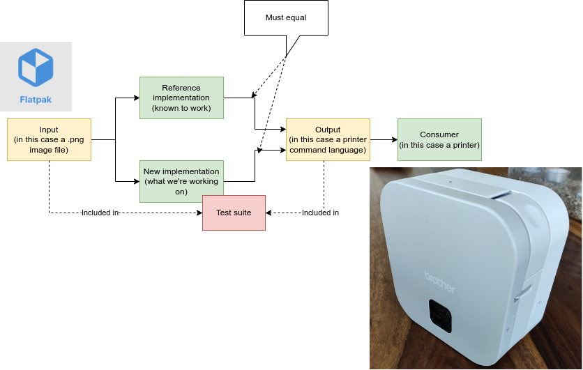
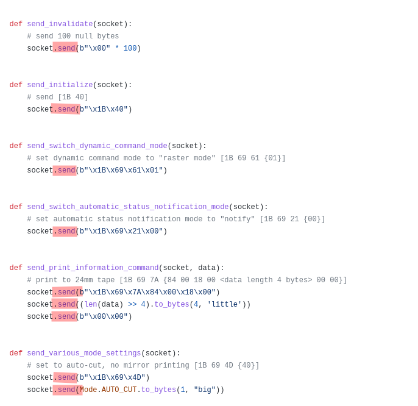
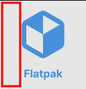

This basic principle has worked for me many times, so I figured it might be worth to share the process.

In this instance I wanted to write a label printer driver in Go.
A barebones implementation exists in Python that works to print a test image.


The idea
--------

If I can reach parity with the Python-based implementation (from now on referred to as the reference implementation),
I can build on top of a working baseline.

But how to reach parity? By writing tests that assert that we are sending the *exact same bits* as the reference implementation.




Capturing sent data from the reference implementation
-----------------------------------------------------

At high level this specific printer uses a serial port over Bluetooth.

We can observe that
[the reference implementation](https://github.com/robby-cornelissen/pt-p710bt-label-maker/tree/99e76c71f4fd6c56e7ff411494034751213a1777)
sends each datagram with the socket's `send()` method:



If we capture all data sent to the `send()` method, then we can in our implementation have a test
suite that asserts that we will send the same data.

To record the data, I changed all call sites to use a wrapper that stores those invividual datagrams:

```diff
 def send_initialize(socket):
     # send [1B 40]
-    socket.send(b"\x1B\x40")
+    socket_send(socket, b"\x1B\x40")
```

The implementation of the new `socket_send()` just wraps the send and also stores the sent datagram in a list:

```python
sent_datagrams = []

def socket_send(socket, data):
    # base64 because: https://stackoverflow.com/questions/44682018/typeerror-object-of-type-bytes-is-not-json-serializable
    # I have to... decode it to ascii...???! 🤦
    sent_datagrams.append(base64.b64encode(data).decode('ascii'))
    socket.send(data)
```

At end of the reference program run we dump the datagrams as JSON. If you're curious, here is the
[full changeset](https://github.com/joonas-fi/pt-p710bt-label-maker/commit/1ac56f3b8038bcc870e1cb6c8405f1ce97d46d26).

The choice of JSON was just a convenience in getting the data out in an interoperable format.

I ran the reference program successfully like this:

```console
$ python3 label_maker.py flatpak.png EC:79:49:...
```

NOTE: I later in Go side changed the base64 to hex representation. If I were to do it again, I would
have already done that at Python side.


Making a test suite at Go side
------------------------------

The data from `sent_datagrams.json` gives us something like this:

```go
var referenceImplementationDatagrams = []string{
	"00000000000000000000000000000000000000000000000000000000000000000000000000000000000000000000000000000000000000000000000000000000000000000000000000000000000000000000000000000000000000000000000000000000",
	"1b40",
	"1b6953",
	"1b696101",
	"1b692100",
	"1b697a84001800"
	"80000000"
	"0000",
	"1b694d"
	"40",
	"1b694b08",
	"1b69640000",
	"4d02",
	"5a",
	"5a",
	"5a",
	"5a",
	"5a",
	"5a",
	"5a",
	"5a",
	// rest of lines snipped ...
}
```

This is all that's required to make tests at our new implementation side to guarantee that our
program will send the same data!

This might look scary (what do all those bytes mean?), but I promise it will make sense later!

Let's go one step at a time.

The basic structure of the reference implementation was luckily quite easy to read.
Here are all the function calls, that end up sending a datagram, marked with an arrow:

```python
def make_label(image_path, bt_address, bt_channel):
    data = encode_png(image_path)

    with bt_socket_manager(bluetooth.RFCOMM) as socket:
        socket.connect((bt_address, bt_channel))

        send_invalidate(socket)                                          # <--
        send_initialize(socket)                                          # <--
        send_status_information_request(socket)                          # <--

        status_information = receive_status_information_response(socket)
        handle_status_information(status_information)

        send_switch_dynamic_command_mode(socket)                         # <--
        send_switch_automatic_status_notification_mode(socket)           # <--
        send_print_information_command(socket, data)                     # <--
        send_various_mode_settings(socket)                               # <--
        send_advanced_mode_settings(socket)                              # <--
        send_specify_margin_amount(socket)                               # <--
        send_select_compression_mode(socket)                             # <--
        send_raster_data(socket, data)                                   # <--
        send_print_command_with_feeding(socket)                          # <--

```

Sidenote: the `receive_status_information_response()` receives from the socket, but we can ignore the
receive side for now and focus on the send side.
In fact the serial port doesn't even know if we received the data or not, so it doesn't matter!

In essence we know that output of `send_invalidate()` is one hundred zeroes.
We can at Go side make a test for that. We can also annotate the datagrams at the test suite to make
the protocol visually easier to see:

```go
// NOTE: string concatenations mean multiple datagram-writes collapsed into one
var referenceImplementationDatagrams = []string{
	"00000000000000000000000000000000000000000000...", // sendInvalidate
	"1b40",                                 // sendInitialize
	"1b6953",                               // sendStatusInformationRequest
	"1b696101",                             // sendSwitchDynamicCommandMode
	"1b692100",                             // sendSwitchAutomaticStatusNotificationMode
	"1b697a84001800" + "80000000" + "0000", // sendPrintInformationCommand
	"1b694d" + "40",                        // sendVariousModeSettings
	"1b694b08",                             // sendAdvancedModeSettings
	"1b69640000",                           // sendSpecifyMarginAmount
	"4d02",                                 // sendSelectCompressionMode
	"5a",                                   // this and next 128 are sendRasterData
	"5a",
	"5a",
	"5a",
	"5a",
	"5a",
	"5a",
	"5a",
	// rest of lines snipped ...
```

It should now be starting to fit together in our head: the datagrams correlate with function outputs!

I also collapsed multiple datagrams into one combined datagram in functions that at reference
implementation make multiple calls to socket's `send()` but are actually one logical datagram:

```python
# this will end up sending something like "1b697a84001800800000000000" (with some bytes dynamic based on `data` input)
def send_print_information_command(socket, data):
    # print to 24mm tape [1B 69 7A {84 00 18 00 <data length 4 bytes> 00 00}]
    socket.send(b"\x1B\x69\x7A\x84\x00\x18\x00")
    socket.send((len(data) >> 4).to_bytes(4, 'little'))
    socket.send(b"\x00\x00")
```

I suspect the reason for multiple `send()` calls was ease of implementation. The serial port doesn't
care or see `send()` boundaries, and the term "datagram" that I use is somewhat imaginary concept in
this protocol since it doesn't have structural framing (length of datagrams are defined entirely
on "payload" parsing rules).

Now we can make a test to call our Go functions in order, that asserts that we send the same bytes:

```go
func TestAgainstReferenceImplementation(t *testing.T) {
	// we know that imageData in reference implementation contains raw bytes.
	// we can as a first test try to give out just null-bytes, but how many?
	// the test image we used was 128x128 pixels.
	// /8 because it's using 1-bit colors meaning one byte fits 8 pixels.
	// this was a detail I had to study the reference implementation code for.
	//
	// we could of course have added logging to the reference implementation to learn that same information.
	imageData := make([]byte, 128*128/8)

	// same order as `referenceImplementationDatagrams`
	orderOfFns := []func() []byte{
		sendInvalidate,
		sendInitialize,
		sendStatusInformationRequest,
		sendSwitchDynamicCommandMode,
		sendSwitchAutomaticStatusNotificationMode,
		sendPrintInformationCommand(imageData),
		sendVariousModeSettings,
		sendAdvancedModeSettings,
		sendSpecifyMarginAmount,
		sendSelectCompressionMode, // datagramIdx==9

		// we don't want to repeat 128 times `sendRasterData` here, so it'll be explicitly handled by the code below

		// sendRasterData(imageData), // for phases 10 onwards for the next 128 datagrams
		// sendPrintCommandWithFeeding, // last one
	}

	makeDatagram := func(imageData []byte, datagramIdx int) []byte {
		switch {
		case datagramIdx < len(orderOfFns):
			return orderOfFns[datagramIdx]()
		case datagramIdx < len(orderOfFns)+128:
			return sendRasterData(imageData, datagramIdx-len(orderOfFns))
		default: // last one
			return sendPrintCommandWithFeeding()
		}
	}

	for i := 0; i < len(referenceImplementationDatagrams); i++ {
		sentByUs := makeDatagram(imageData, i)
		sentByReferenceImplementation, err := hex.DecodeString(referenceImplementationDatagrams[i])
		assert.Ok(t, err)

		if !bytes.Equal(sentByUs, sentByReferenceImplementation) {
			t.Errorf("datagram[%d]: %x (ref) %x (us)", i, sentByReferenceImplementation, sentByUs)
		}
	}
}
```

We can get the test suite to compile by defining stubs:

```go
var (
	sendInvalidate                            = unimplemented
	sendInitialize                            = unimplemented
	sendPrintCommandWithFeeding               = unimplemented
	sendStatusInformationRequest              = unimplemented
	sendSwitchDynamicCommandMode              = unimplemented
	sendSwitchAutomaticStatusNotificationMode = unimplemented
	sendVariousModeSettings                   = unimplemented
	sendAdvancedModeSettings                  = unimplemented
	sendSpecifyMarginAmount                   = unimplemented
	sendSelectCompressionMode                 = unimplemented
)

// these below two functions have output that depends on input

func sendPrintInformationCommand(imageData []byte) func() []byte {
	return func() []byte {
		return nil
	}
}

func sendRasterData(imageData []byte, chunkIdx int) []byte {
	return nil
}

func unimplemented() []byte {
	return nil
}
```

Now the test suite compiles.


Making the first tests pass
---------------------------

Now running tests we get:

```console
main_test.go:79: datagram[0]: 0000000000000... (ref)  (us)
```

It tells us that for very first datagram we should return hundred zeroes but we're returning nothing.

Let's fix the first two datagrams by replacing the stubs with better implementations:

```go
func sendInvalidate() []byte {
	hundredZeroBytes := make([]byte, 100)
	return hundredZeroBytes
}

// from docs:
// > Initializes mode settings.
func sendInitialize() []byte {
	return []byte{0x1b, 0x40}
}
```

Now the tests only fail from the 3rd datagram forward.
It's easy to look at the expected datagrams while looking at the reference implementation (and if
in doubt, also looking at the protocol documentation if that is available).

The first dynamic and non-obvious function to implement from the reference implementation:

```python
def send_print_information_command(socket, data):
    # print to 24mm tape [1B 69 7A {84 00 18 00 <data length 4 bytes> 00 00}]
    socket.send(b"\x1B\x69\x7A\x84\x00\x18\x00")
    socket.send((len(data) >> 4).to_bytes(4, 'little'))
    socket.send(b"\x00\x00")
```

It isn't quite explaining why it's shifting the length of the data by four, but anyway let's go on.
The `'little'` hints us that we use little-endian encoding:

```go
func sendPrintInformationCommand(imageData []byte) func() []byte {
	dataLenShiftedByFour := len(imageData) >> 4

	// print to 24mm tape [1B 69 7A {84 00 18 00 <data length 4 bytes> 00 00}]
	return func() []byte {
		msg := []byte{0x1B, 0x69, 0x7A, 0x84, 0x00, 0x18, 0x00}
		msg = binary.LittleEndian.AppendUint32(msg, uint32(dataLenShiftedByFour))
		msg = append(msg, 0x00, 0x00)

		return msg
	}
}
```

This datagram test now passes.


Fixing the rest of the tests
----------------------------

Now the next failure is the 11th datagram. It is the first `5a` i.e. the first datagram produced by `sendRasterData()`.

The reference looks quite intimidating:

```python
def send_raster_data(socket, data):
    # send all raster data lines
    for line in rasterize(data):
        socket.send(bytes(line))

# (these come from separate file - I'm summarizing here)

CHUNK_SIZE = 16
ZERO_CHUNK = bytearray(b"\x00" * CHUNK_SIZE)
ZERO_COMMAND = b"\x5A"

def rasterize(encoded_image_data):
    for i in range(0, len(encoded_image_data), CHUNK_SIZE):
        buffer = bytearray()
        chunk = encoded_image_data[i:i + CHUNK_SIZE]
        
        if chunk == ZERO_CHUNK:
            buffer += ZERO_COMMAND
        else:
            packed_chunk = packbits.encode(chunk)

            buffer += RASTER_COMMAND
            buffer += len(packed_chunk).to_bytes(2, "little")
            buffer += packbits.encode(chunk)
        
        yield buffer
```

At reference side this is called once and it sends 128 datagrams.
It looks to be for every 16 bytes of image raw data either emitting a "zero command" or a compressed chunk.

At Go side, for testability, we modeled this `sendRasterData()` to be called once for each expected
datagram, varying its input on `chunkIdx` so the looping is done *by the caller instead*.

Since the code looks to be at some times outputting the "zero command" and it looks to be doing that
when the bytes are all zeroes, we can handle that and leave the compression still stubbed out:

```go
const chunkLen = 16

// this is where the image data is sent
func sendRasterData(imageData []byte, chunkIdx int) []byte {
	chunk := imageData[chunkLen*chunkIdx : chunkLen*chunkIdx+chunkLen]

	if byteSliceAllZeroes(chunk) { // chunk all black pixels?
		return []byte{0x5a} // zero command
	} else {
		return nil // TODO: implement compression
	}
}

func byteSliceAllZeroes(b []byte) bool {
	for _, item := range b {
		if item != 0x00 {
			return false
		}
	}
	return true
}
```

How far does that get us? Let's see:

```console
main_test.go:73: datagram[43]: 470800fd00fdff0080fa00 (ref) 5a (us)
```

So our implementation "sent" 43 datagrams successfully and only then encountered a mismatch compared
to the reference implementation! Datagram-wise our progress is 43/139 i.e. 30 %! Pretty nice.

33 of those 43 datagrams were actually already image data (those `5a` datagrams) so looks like we
got lucky by guessing we could give null bytes as the `imageData` and our test image just happened
to contain black pixels (as sent by the reference implementation) only closer to center of the image
(which means later in the datagram order):



Red rectangle denotes the quiet area. We know from looking at the reference implementation that it
rotates the image first so left side becomes the top side in the datagram order.

I next had the task of actually loading the test image as PNG (instead of giving null bytes for the
image data) and then implementing the pixel compression.

However those are not relevant to this article as I hope the basic principle has been demonstrated
enough already. 🙂

Implementing those features was quite straightforward and it made the tests pass.


## Result: working prints

After the tests passed for the first time, using my implementation to print to the printer worked
on the first try. 🎉


Above is the reference implementation print, below is my implementation.

p.s. don't mind the clipping, as the reference implementation forces 128 px height for the picture
and my printer doesn't seem to print the full 128 px height.
I guess the print area (or resolution) is smaller in my printer compared to the exact printer that
the reference implementation supports. I will now have quite easy time in fixing it now that I have working baseline.

## Summary

We went over an approach to capture known-good datagrams from a reference implementation and then
have a test suite guide us in implementing bit-exact (protocol-level) replica of the new implementation.

A nice property is that we had to only run the reference program once.
After the datagram set was captured, it's mainly working with that from then on.
Of course looking at the reference implementation code helps to understand the message contents beyond
plain bytes, but no re-runs are needed.

This same approach has helped me quite many times in my career in different situations.

The approach can be, if needed, applied to larger amounts of data as well, but then you might want
to work with digests instead of raw byte content then.


## Sidetalk: why not extend the original implementation?

Dependencies (Go is better for zero-dependencies binaries) and I wanted to also add quite many
features (barcodes, HTTP API etc.).

You'll find better rationale (and the resulting implementation) here: https://github.com/joonas-fi/bro
